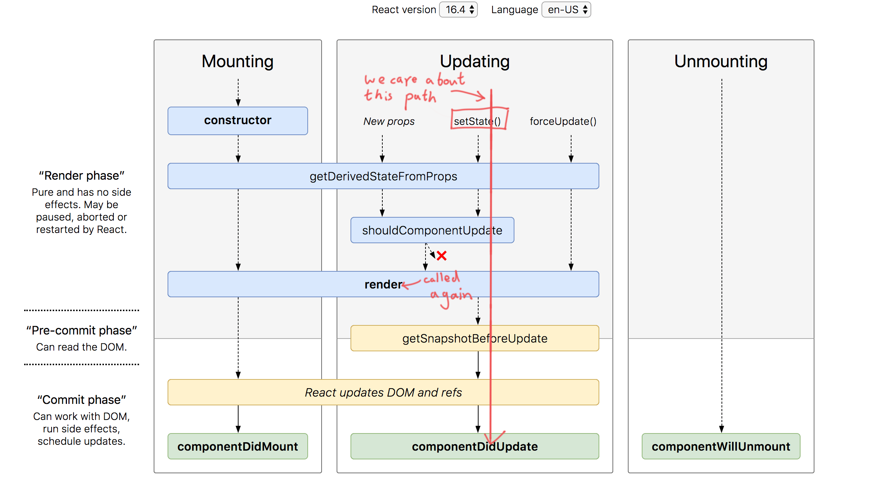
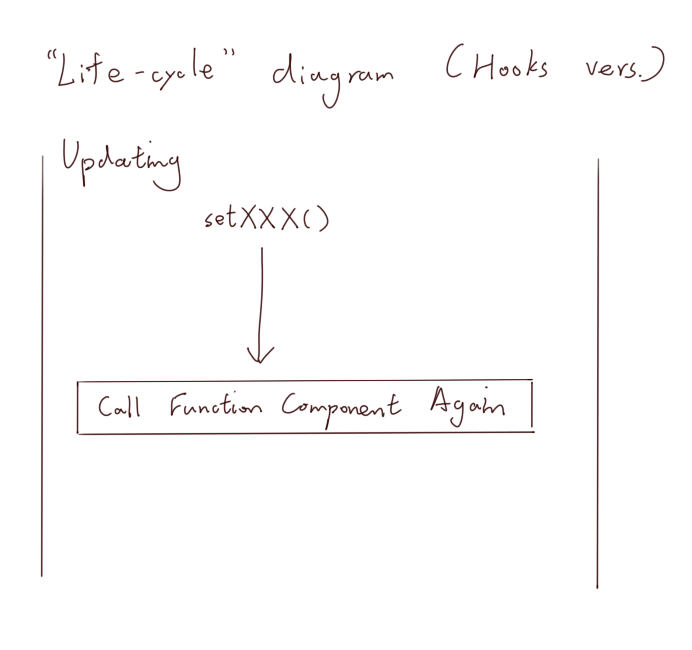
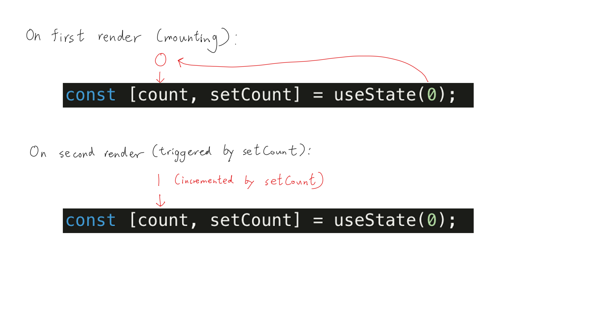
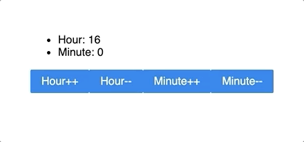
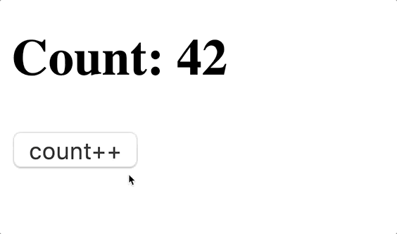
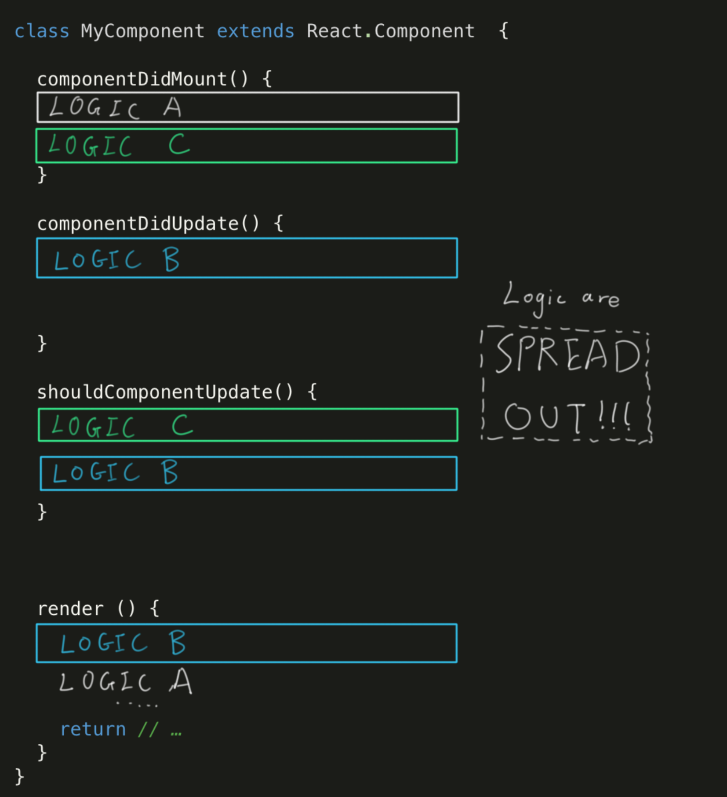
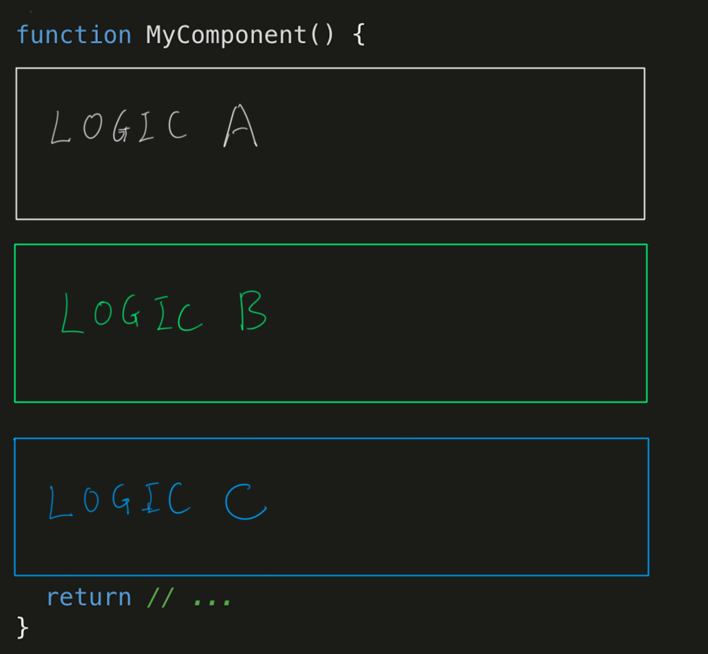

- [Quick Review of the `class` Lifecycle Methods](#quick-review-of-the-class-lifecycle-methods)
- [Quick Review of Function Component](#quick-review-of-function-component)
- [Overview of Hooks](#overview-of-hooks)
  - [`useState`: State in Function Components](#usestate-state-in-function-components)
  - [🍏Application: "Hey React, Set an Alarm" with Multiple `useState`](#application-hey-react-set-an-alarm-with-multiple-usestate)
  - [Introduction to Custom Hooks](#introduction-to-custom-hooks)
  - [`useEffect`: Side Effect in Function Component](#useeffect-side-effect-in-function-component)
  - [🍏Application: "Applying to Boogle" with `useEffect`](#application-applying-to-boogle-with-useeffect)
- [2 Rules of Hooks](#2-rules-of-hooks)
  - [A List Model of Keeping States](#a-list-model-of-keeping-states)
- [🍏Application: "Power of Hooks" with Debouncing](#application-power-of-hooks-with-debouncing)
  - [`setTimeout` and `clearTimeout`](#settimeout-and-cleartimeout)
  - [Implementation](#implementation)
  - [Cleaning up `useEffect`](#cleaning-up-useeffect)
  - [Abstract, Reuse, Custom Hook](#abstract-reuse-custom-hook)
  - [What's Wrong with the Old `class` Way?](#whats-wrong-with-the-old-class-way)
- [Final Challenge](#final-challenge)

## Quick Review of the `class` Lifecycle Methods

Before we dive into hooks, let's review some lifecycle methods
in the old `class` syntax. 
Here are some important ones that we need to know: 

- `setState`: update the state within a component, triggers `render` 
- `componentDidMount`: called when a component is just mounted.
  `componentDidMount` is allowed to perform side-effect here such as API
  calls, and state updates with `setState`
- `render`: React calls `render` to get the updated version of the component
- `componentDidUpdate`: called after the component re-rendered. Side effects allowed

The lifecycle methods are well summarized in the following flow chart:


> See the diagram at: http://projects.wojtekmaj.pl/react-lifecycle-methods-diagram/

Exercise: Build a simple counter component, but the initial value 
of the counter is given by the server. Here we emulate an API call
to fetch the initial value.

```jsx
// faking a call to the server to get an initial value
function getInitialCounterValue() {
  return new Promise(resolve => setTimeout(() => resolve(3), 200));
}
```

<details>

<summary> Click to see solution </summary>

  ```jsx
  class Counter extends React.Component {
    state = { count: 0 }

    constructor() {
      this.onIncrement = this.onIncrement.bind(this);
    }

    componentDidMount() {
      getInitialCounterValue().then(count => {
        this.setState({ count });
      });
    }

    onIncrement() {
      this.setState(({ count }) => { count: count + 1 });
    }

    render() {
      return (
        <div>
          <h3>{this.state.count}</h3>
          <button onClick={this.onIncrement}>Increment</button>
        </div>
      );
    }
  }
  ```

</details>

## Quick Review of Function Component

For some simple component that has no state (__stateless component__), 
using the class syntax can be quite "wordy".

```jsx
class MyDisplayInfoComponent extends React.Component {
  render() {
    return (
      <ul>
        <li>Name: {this.props.name}</li>
        <li>Major: {this.props.major}</li>
      </ul>
    );
  }
}
```

To get reduce the amount of code we have to write,
we can use functions to write component instead of class.

```jsx
function MyDisplayInfoComponent (props) {
  return (
    <ul>
      <li>Name: {props.name}</li>
      <li>Major: {props.major}</li>
    </ul>
  );
}
```

To simplify it further, we can even use the ES6 arrow
function syntax and parameter destructuring assignment.

```jsx
const MyDisplayInfoComponent = ({ name, major }) => (
  <ul>
    <li>Name: {props.name}</li>
    <li>Major: {props.major}</li>
  </ul>
);
```

These stateless components are said to be _pure functions_.
Pure functions are simply functions in programming that 
obeys the property of a mathematical function:
given the same input _x_, it produces the same output _y_.
Stateless components are pure since given the same parameters,
they always return the same component, as long as the children
components are also stateless. 


## Overview of Hooks

The function component syntax is nice and simple. 
Having code that is readable means that it is more 
maintainable. 
The function component syntax also makes more sense 
since you are passing in a bunch of arguments to a function
and the function just returns a React Component. 

```jsx
// Here I passed in the argument `name` and `major`
// and this expression should return a React Component.
<MyDisplayInfoComponent name="Galen" major="CS" />
```

However, the problem is that there can be no state within
a function component.
You cannot even implement a simple counter with just
the function component. 

With hooks, you can write a counter with a function component.
To keep a state in a function component, we can use the `useState` hooks. 

### `useState`: State in Function Components

The syntax of `useState` works as such:
```jsx
// importing the hooks
import React, { useState } from 'react';

// inside the component
const [currentState, setterFunction] = useState(initialState);
```

The `useState` function takes in an initial state, and returns
an array with 2 elements: the first being the current value of the 
state, the second being a function to change the state. 
Think of the second function as `setState`. It is going to trigger
the re-render of the component. 

Let's implement a simple counter with `useState`.

```jsx
function SimpleCounter() {
  const [count, setCount] = useState(0);

  const onClickCallback = () => {
    setCount(count + 1);
  };

  return (
    <div>
      <p>Count: {count}</p>
      <button onClick={onClickCallback}>increment</button>
    </div>
  );
}
```

Here, the initial state of `count` will be set to `0`.
So the initial count the user see is 0. 
Then, we created a callback `onClickCallback`, for
the `button` to increment the counter using `setCount`. 

In the a class syntax, a call to `setState` will causes a 
re-render. In other words, the `render` class method will
be executed again. 



How does a functional component, without the `render` method 
re-render then?
Every time you call the `set`ter function returned from
a hook, React is going to re-execute the function component
"function" again. 



The reason that you need to re-execute the entire component 
function is such that you call the `useState` hook again to
obtain the current state of the counter. 



### 🍏Application: "Hey React, Set an Alarm" with Multiple `useState`

> Exercise: Can you implement a component that allow an user
> to select time for an alarm with hooks? 
> An user should be able to increment or decrement the hour 
> and the minute using buttons.



In the previous exercise, you had to keep track of multiple states.
You have two options: 1) you keep an object with `useState`, 
1) you call `useState` twice.

If we go with option 1, the code would look like this.

```jsx
function SetAlarm() {
  const [time, setTime] = useState({ hour: 16, minute: 0 });

  // we ignore the fact that hour/minute cannot be negative
  const incrementHour = () => setTime({
    hour: hour + 1,
    minute
  });

  const decrementHour = () => setTime({
    hour: hour - 1,
    minute
  });

  const incrementMinute = () => setTime({
    hour,
    minute: minute + 1,
  });

  const decrementMinute = () => setTime({
    hour,
    minute: minute - 1,
  });

  return (
    <div>
      <h2>Hour: {time.hour}</h2>
      <h2>Minute: {time.minute}</h2>
      <button onClick={incrementHour}>hour++</button>
      <button onClick={decrementHour}>hour--</button>
      <button onClick={incrementMinute}>minute++</button>
      <button onClick={decrementMinute}>minute--</button>
    </div>
  );
}
```

If you go with option 2, your code looks like this.

```jsx
function SetAlarm() {
  const [hour, setHour] = useState(16);
  const [minute, setMinute] = useState(0);

  const incrementHour = () => setHour(hour + 1);
  const decrementHour = () => setHour(hour - 1);
  const incrementMinute = () => setMinute(minute + 1);
  const decrementMinute = () => setMinute(minute - 1);

  return (
    <div>
      <h2>Hour: {hour}</h2>
      <h2>Minute: {minute}</h2>
      <button onClick={incrementHour}>hour++</button>
      <button onClick={decrementHour}>hour--</button>
      <button onClick={incrementMinute}>minute++</button>
      <button onClick={decrementMinute}>minute--</button>
    </div>
  );
}
```

Using multiple `setState` makes our code shorter and more 
readable. It also makes more sense since `hour` and `minute`
are simply 2 separate counters that has no relationship with
each other. Keeping them in the same object within the same
state is not really necessary.

Notice what we have just said, they are 2 separate counters.
This implies they use the same logic. 
We know one of the important property of functions is to help
us abstract and share logic. Can we abstract the counter logic
into its own independent functions? 
Yes! 

### Introduction to Custom Hooks

Let's implement the counter logic in a function.

```js
function useCounter({ initCount }) {
  const [count, setCount] = useState(initCount);
  const increment = () => { setCount(count + 1) };
  const decrement = () => { setCount(count - 1) };

  return [count, increment, decrement];
}
```

Now, let's use them within our alarm component.

```jsx
function SetAlarm() {
  const [hour, incrementHour, decrementHour] = useCounter(16);
  const [minute, incrementMinute, decrementMinute] = useCounter(0);

  return (
    <div>
      <h2>Hour: {hour}</h2>
      <h2>Minute: {minute}</h2>
      <button onClick={incrementHour}>hour++</button>
      <button onClick={decrementHour}>hour--</button>
      <button onClick={incrementMinute}>minute++</button>
      <button onClick={decrementMinute}>minute--</button>
    </div>
  );
}
```

We created the `useCounter` function, which creates a state using `useState`,
and returns the current state, and 2 setter functions to mutate the state. 
`useCounter` is a __custom hook__, which is a piece of logic that we composed
using the hooks function (in this case, `useState`) that React provided. 

That is the actual motivation of the new hooks API: sharing logic among
components. Think about using the class syntax, you will have to repeat the logic
for the counter, declare the increment and decrement function twice. 
At this point, if you have another component that uses a counter, you
can simply reuse the `useCounter` custom hook. 

This is a really important pattern of logic sharing that React hooks syntax
is trying to get at. It changes how we fundamentally write and think about
React. If you don't get this now, don't worry. We will re-iterate again
with a more involved demo. 


### `useEffect`: Side Effect in Function Component

Let's go back to our first exercise. 
We want to implement a counter with the initial value that depends on
a state on the server. 
How would you go about that in function components with hooks?

```jsx
function CounterDependingOnServer() {
  const [count, setCount] = useState(0);

  // spoiler alert: this is WRONG!
  getInitialCounterValue().then(val => {
    setCount(val);
  });

  const increment = () => { setCount(count + 1) };

  return (
    <div>
      <h2>Count: {count}</h2>
      <button onClick={increment}>count++</button>
    </div>
  );
}
```

This will trigger an infinite update loop. 
When we first render the component, we will call the API
to get the initial counter state. Then, the callback calls 
`setCount`, which triggers a re-render…



We want of think of the entire body of a function component
as the body of `render` in a class component. If there were
side effects in `render`, like `setState`, it can cause 
infinite update of our component. Therefore, side effects
are not allowed in the `render` function, and should 
also not be allowed in function component body also.

> Note: common side effects include data fetching, 
> setting up a subscription (think 
> [media query](https://developer.mozilla.org/en-US/docs/Web/CSS/Media_Queries/Using_media_queries)),
> and DOM updates.

Think back on how you would do it in a class component.
You will give it a default state first in the constructor first, 
and update it later in `componentDidMount`. 
`componentDidMount` is responsible for executing code
with side effects. Can we use the same approach here?

To execute code after render in a function component,
we use the `useEffect` hook.

```jsx
// importing the hooks
import React, { useEffect } from 'react';

// inside the component
useEffect(functionWithSideEffect);
```

When you pass a function to `useEffect`,
React will execute the function after your component
is rendered every time. 
However, we only want to execute it on the first render.
We can keep a state to indicate if we have called the API.

```jsx
function CounterDependingOnServer() {
  const [count, setCount] = useState(0);
  const [fetched, setFetched] = useState(false);

  useEffect(() => {
    if (fetched) return;
    getInitialCounterValue().then(val => {
      setFetched(true);
      setCount(val);
    });
  });

  return (
    <div>
      <h2>Count: {count}</h2>
      <button onClick={increment}>count++</button>
    </div>
  );
}
```

This works. But this is not the cleanest code. 
We have an extra state that is only changed once.
We can actually supply an extra parameter to `useEffect`
to say tell React we only want this side effect to be
executed once after the first render.

```jsx
function CounterDependingOnServer() {
  const [count, setCount] = useState(0);
  
  useEffect(() => {
    getInitialCounterValue().then(val => {
      setCount(val);
    });
  // notice the second parameter we passed in here
  }, []);

  return (
    <div>
      <h2>Count: {count}</h2>
      <button onClick={increment}>count++</button>
    </div>
  );
}
```

If you pass in an empty array, you are telling React 
to only execute this once, making the `useEffect` hook
just like `componentDidMount`.

But why an empty array?
What happens if we pass in a non-empty array?
This array is called a dependency array, which 
can help us optimize our application. 

### 🍏Application: "Applying to Boogle" with `useEffect`

You work for Boogle, a tech company that really cares about
good applicant experience during job application. You are
writing a React application that let applicants input their
information, and back them up every time it is updated.

Let's forget about backing up for a second and build a 
simple form.
First, we will need some state and input fields. 

```jsx
function ApplicationForm() {
  const [name, setName] = useState('');
  const [email, setEmail] = useState('');
  const [school, setSchool] = useState('');

  return (
    <div>
      Name: <input value={name}/>
      Email: <input value={email}/>
      School: <input value={school}/>
    </div>
  );
}
```

Then, we need a `onChange` handler to capture the value
that user typed in.

```jsx
function ApplicationForm() {
  const [name, setName] = useState('');
  const [email, setEmail] = useState('');
  const [school, setSchool] = useState('');
  
  const updateName = e => setName(e.target.value);
  const updateEmail = e => setEmail(e.target.value);
  const updateSchool = e => setSchool(e.target.value);

  return (
    <div>
      Name:   <input onChange={updateName} value={name}/>
      Email:  <input onChange={updateEmail} value={email}/>
      School: <input onChange={updateSchool} value={school}/>
    </div>
  );
}
```

Let's add a button to submit to application.
But before that, we also want to have a check box to make sure
the applicant agree with our terms and conditions 
~~that they are never gonna read~~. 

```jsx
function ApplicationForm() {
  const [agreeToTerms, setAgreeToTerms] = useState('');
  const [name, setName] = useState('');
  const [email, setEmail] = useState('');
  const [school, setSchool] = useState('');
  
  const updateName = e => setName(e.target.value);
  const updateEmail = e => setEmail(e.target.value);
  const updateSchool = e => setSchool(e.target.value);
  const updateAgreeToTerms = e => 
    setAgreeToTerms(e.target.checked);

  const onClickSubmitApp = () => {
    // an imaginary application submit function
    if (agreeToTerms)
      submitApplication(name, email, school);
  };

  return (
    <div>
      Name:   <input onChange={updateName} value={name}/>
      Email:  <input onChange={updateEmail} value={email}/>
      School: <input onChange={updateSchool} value={school}/>
      <input type="checkbox" onChange={setAgreeToTerms} value={agreeToTerms}/>
      By checking this box, you agree to our Terms and Conditions.
      <button onClick={onClickSubmitApp}>submit my application</button>
    </div>
  );
}
```

At this point, you should have something that looks like
this (don't worry about CSS and layout):


Now, we want to back up the applicant's input. 
We want to back it up as frequently as possible.
As user update the value of any input fields, 
we make a backup. We can define an imaginary backup
function like this.

```js
// inside the component
const backupOnUpdate = () => {
  backup(name, email, school);
  console.log('data backed up!');
};
```

We can backup upon every keystroke by changing
our event listener functions to

```js
const updateName = e => {
  setName(e.target.value);
  backupOnUpdate();
};
const updateEmail = e => {
  setEmail(e.target.value);
  backupOnUpdate();
};
const updateSchool = e => {
  setSchool(e.target.value);
  backupOnUpdate();
};
// we don't need to back up upon agreement
const updateAgreeToTerms = e => 
 setAgreeToTerms(e.target.checked);
```

This violates the DRY principle. 
We are repeating the back up code 3 times. 
Is there an easy way to reduce the amount of code to 
type in the class syntax, with the lifecycle
method `componentDidUpdate`. Since this is called
when state is mutated, we can call `backupOnUpdate`
in here.

```jsx
componentDidUpdate() {
  const { name, email, school } = this.state;
  backup(name, email, school);
}
```

What is the hook-equivalent of `componentDidUpdate` then?
`componentDidUpdate` is executed after each `render`, so is 
the `useEffect` hook!
We can put our update function into `useEffect`.

```jsx
function ApplicationForm() {
  const [agreeToTerms, setAgreeToTerms] = useState('');
  const [name, setName] = useState('');
  const [email, setEmail] = useState('');
  const [school, setSchool] = useState('');
  
  const updateName = e => setName(e.target.value);
  const updateEmail = e => setEmail(e.target.value);
  const updateSchool = e => setSchool(e.target.value);
  const updateAgreeToTerms = e => 
    setAgreeToTerms(e.target.checked);

  const onClickSubmitApp = () => {
    if (agreeToTerms)
      submitApplication(name, email, school);
  };

  // componentDidUpdate
  useEffect(() => {
    backup(name, email, school);
  });

  return (
    <div>
      Name:   <input onChange={updateName} value={name}/>
      Email:  <input onChange={updateEmail} value={email}/>
      School: <input onChange={updateSchool} value={school}/>
      <input type="checkbox" onChange={setAgreeToTerms} value={agreeToTerms}/>
      By checking this box, you agree to our Terms and Conditions.
      <button onClick={onClickSubmitApp}>submit my application</button>
    </div>
  );
}
```

This will back up the data upon every keystroke. 
However, do you think this make too many backups?
Consider the user clicking the checkbox to accept the 
"Terms and Conditions". It will trigger a render,
since we use a state setter function (`setXXX`). It will 
trigger `useEffect` but none of the data (`name`, `email`,
`school`) that requires back up has changed. 

We want to tell React to only execute `useEffect` only when
the data that needs to back up has changed. The second parameter
for `useEffect` is called the _dependency array_. `useEffect`
will execute only if any of the value has changed. 
```jsx
useEffect(() => {
  backup(name, email, school);
}, [name, email, school]);
```

If any value of the variable `name`, `email` and `school` changes, 
the `useEffect` callback will be executed and performs a backup.
This way, we skipped unnecessary backups that can take up
resources like bandwidth, CPU, memory and such.

Now look back to the pattern of using `useEffect` as 
`componentDidMount`, we pass in an empty array as the dependency.
That means that "all" the value in the array will never change,
since there are no values. Therefore, the `useEffect` callback
will only execute on the initial render, acting like
`componentDidMount`.


Let's validate by writing a mock `backup` function. 
```js
function backup(name, email, school) {
  console.log('back up!')
}
```


For more information, take a look at the official 
documentation for React: 
[Optimizing Performance by Skipping Effects](https://reactjs.org/docs/hooks-effect.html#tip-optimizing-performance-by-skipping-effects).

<hr>

At this point, you can successfully migrate 80% of your
class components to function components, using a simple
mapping from the old lifecycle method to the new hooks API.

|`class` component|`function` component|
|:--:|:--:|
| `this.setState`, `this.state` | `useState`|
| `componentDidMount` | `useEffect(cb, [])`|
| `componentDidUpdate` | `useEffect(cb)` |

## 2 Rules of Hooks

When you are using hooks, you have to follow 2 rules:
1. Only call hooks at the top level
2. Only call hooks from function components and custom hooks

Read about them here: https://reactjs.org/docs/hooks-rules.html.
Focus on the explanation section.

After reading the explanation, can you answer the following questions?

1. When `useState` is called, how does React know which state to return?
2. Can you call hooks from a class component? Why?
3. How do you use a hook with a class component (think "out of the box")?

### A List Model of Keeping States

> When `useState` is called, how does React know which state to return?

The only data passed to `useState` is the initial state, which
does not contain enough information for React to determine which 
state the component wants.

To answer this question, we look at the first rule of hooks.
If hooks are guaranteed to be called at the top level, that means
the hooks will not be inside `if`-statements or loops or any other
kind of conditional construct. 
If such condition is met, the hooks will run in a linear and deterministic manner.
In other words,
- Linear: we know in what order will the hooks be called
- Deterministic: we know how many times will the hooks be called

With nice properties, React can simply keep track of the state for 
a component in an array. When `useState` is called the *n*th time, React can
return the *n*th element from the array. 
Therefore, the first rule of hooks is very important in the design
of the hooks pattern.


Question 2 and 3 is left as an exercise to the reader. 
You can find the answer here: 
https://infinum.co/the-capsized-eight/how-to-use-react-hooks-in-class-components

## 🍏Application: "Power of Hooks" with Debouncing

"Debouncing" is a rate-limiting technique to reduce the frequency
of execution of time-consuming tasks. 
Some examples include live spell-checking, search suggestion, etc.


Notice the delay in the suggestion popping up after I type some
characters into Google. The motivation of debouncing is quite 
easy to understand: we save useless computation that the user
probably won't need. For instance, there is no point to
return a list of suggestion for the search keyword "reac"
when the user will finish typing in less than 100ms and actually
search for the keyword "react".

Let's see how we can implement a search bar with debouncing. 
First, a mock function to emulate a suggestion algorithm.

```js
async function getSearchSuggestions(input) {
  const results = [
    'How to ' + input,
    input + ' with my grandma',
    'What is ' + input,
    'Who is ' + input,
    input + ' in Los Angeles',
    'free ' + input,
  ];
  // shuffle the result a bit
  results.sort(() => Math.random() - 0.5);
  return results;
}
```

Here is an outline of how debouncing works:

```
when "value" is updated (from typing):
  if an "action" is scheduled previously
    cancel the "action"

  schedule an "action" to execute after a given delay
```

In other words, debouncing will execute the "action"
if the "value" has not updated for some amount of delay.

### `setTimeout` and `clearTimeout`

We already know how to trigger a side-effect when a 
value is updated with `useEffect`. But how do we delay 
the side effect?
In JavaScript, we can schedule callback to execute after
a delay using `setTimeout`, which returns a timer handle
that can be used to cancel the task with `clearTimeout`.

```js
setTimeout(() => console.log('timeout in 500ms'), 500);

const timerID = setTimeout(() => console.log('will be cancelled'), 500);
clearTimeout(timerID);

const timerID2 = setTimeout(() => {
  console.log('will be cancelled before firing')
}, 600);

setTimeout(() => {
  console.log('cancelling timerID2 100ms before it is executed');
  clearTimeout(timerID2);
}, 500);

// output: 
// timeout in 500ms
// cancelling timerID2 100ms before it is executed
```

Knowing the `setTimeout` mechanism, we can now implement a search
bar that is debounced!

### Implementation 

We start with a simple search bar without debouncing.

```jsx
function SearchBar() {
  const [search, setSearch] = useState('');

  const updateSearch = e => setSearch(e.target.value);

  return (
    <div>
      <input onChange={updateSearch} value={search} />
    </div>
  );
}
```

Let's implement our debouncing logic. We know that we want 
to execute it when the value of `search` has changed. Using 
`useEffect`, we can execute `getSearchSuggestions` when 
`search` is udpated.


```jsx
const [suggestions, setSuggestions] = useState([]);

useEffect(() => {
  // get search suggestions…
  if (search === '') {
    setSuggestions([]);
    return;
  }
  getSearchSuggestions(search).then(results => {
    setSuggestions(results);
  });
  // when search is updated
}, [search]);


// display the suggestions
return (
  // …
  <ul>
    {suggestions.map(s => <li>{s}</li>)}
  </ul>
)
```

Now, we delay the operation by a given amount of delay.

```jsx
function SearchBar() {
  const [search, setSearch] = useState('');

  const updateSearch = e => setSearch(e.target.value);

  const [suggestions, setSuggestions] = useState([]);

  useEffect(() => {
    // delay getting search suggestions
    setTimeout(() => {
      if (search === '') {
        setSuggestions([]);
        return;
      }
      getSearchSuggestions(search).then(results => {
        setSuggestions(results);
      });
    }, 500); // by 500ms

  }, [search]);

  return (
    <div>
      <input onChange={updateSearch} value={search} />
      <ul>
        {suggestions.map(s => <li>{s}</li>)}
      </ul>
    </div>
  );
}
```


However, this will only delay all get search suggestions 
operations by 250ms, because we never cancel the previous
operation.
To implement our debouncing logic, we need to keep a 
timer state, so we can cancel it later with `clearTimeout`.

```jsx
function SearchBar() {
  const [search, setSearch] = useState('');

  const updateSearch = e => setSearch(e.target.value);

  const [suggestions, setSuggestions] = useState([]);
  const [timer, setTimer] = useState(null);

  useEffect(() => {
    // cancel previous operation 
    clearTimeout(timer);

    const id = setTimeout(() => {
      if (search === '') {
        setSuggestions([]);
        return;
      }
      getSearchSuggestions(search).then(results => {
        setSuggestions(results);
      });
    }, 500);
    setTimer(id);

  }, [search]);

  return (
    <div>
      <input onChange={updateSearch} value={search} />
      <ul>
        {suggestions.map(s => <li>{s}</li>)}
      </ul>
    </div>
  );
}
```

There you go. You have a working debounced search bar.

### Cleaning up `useEffect`

However, the logic is convoluted since we now keep track of
an extra state of `timer` just for the cancelling the 
previous scheduled operation.
We are cleaning up after side effects of the previous
`useEffect`.
In fact, this pattern is common enough that the React
team decides to make an API for it. 
In the callback of `useEffect`, you can return a function
that will help you clean up. 
```jsx
useEffect(() => {
  const id = setTimeout(() => {
    if (search === '') {
      setSuggestions([]);
      return;
    }
    getSearchSuggestions(search).then(results => {
      setSuggestions(results);
    });
  }, 500);

  return () => {
    clearTimeout(id);
  };
}, [search]);
```

__The clean up function will be called before the next
`useEffect` callback is triggered.__
Now the code is simpler since we can get rid of the 
`timer` state variable.

```jsx
function SearchBar() {
  const [search, setSearch] = useState('');

  const updateSearch = e => setSearch(e.target.value);

  const [suggestions, setSuggestions] = useState([]);

  useEffect(() => {
    const id = setTimeout(() => {
      if (search === '') {
        setSuggestions([]);
        return;
      }
      getSearchSuggestions(search).then(results => {
        setSuggestions(results);
      });
    }, 500);

    return () => { clearTimeout(id); }
  }, [search]);

  return (
    <div>
      <input onChange={updateSearch} value={search} />
      <ul>
        {suggestions.map(s => <li>{s}</li>)}
      </ul>
    </div>
  );
}
```

Here is a question for you:

> Can we use an async function as the first parameter
> to `useEffect`?

### Abstract, Reuse, Custom Hook

Debouncing is a fairly complex piece of logic. 
However, with the power of react hooks, we can abstract
and reuse this piece of logic very easily.

```jsx
function useDebounce(value, action, delay) {
  useEffect(() => {
    const id = setTimeout(() => action, delay);

    return () => { clearTimeout(id); }
  }, [value, action, delay]);
}

function SearchBar() {
  const [search, setSearch] = useState('');

  const updateSearch = e => setSearch(e.target.value);

  const [suggestions, setSuggestions] = useState([]);

  const updateSuggestion = () => {
    getSearchSuggestions(search).then(results => {
      setSuggestions(results);
    });
  };

  // this one line implements a debounce logic!!!!
  useDebounce(search, updateSuggestion, 250);

  return (
    <div>
      <input onChange={updateSearch} value={search} />
      <ul>
        {suggestions.map(s => <li>{s}</li>)}
      </ul>
    </div>
  );
}
```

Another way of implementing the `useDebounce` hook
is to return the debounced value. 

```jsx
function useDebounce(value, delay) {
  const [debounced, setDebounced] = useState(value);

  useEffect(() => {
    const id = setTimeout(() => {
      setDebounced(value);
    }, delay);

    return () => { clearTimeout(id); }
  }, [value, delay]);

  return debounced;
}
```

In this implementation, we debounce the value of the
`debounced` state variable, and return that to the caller
of this hook. Here is a question for you. 

> How do we debounce callback with this 
> implementation of `useDebounce`?

We can use `useEffect`. `useEffect` is called when
its dependency variable changes. Since the update
to the `debounced` variable is debounced, we can 
let a `useEffect` callback depends on that variable.


```jsx
function SearchBar() {
  const [search, setSearch] = useState('');
  const updateSearch = e => setSearch(e.target.value);

  const [suggestions, setSuggestions] = useState([]);
  const debouncedSearch = useDebounce(search, 250);

  useEffect(() => {
    getSearchSuggestions(debouncedSearch).then(results => {
      setSuggestions(results);
    });
  }, [debouncedSearch]);

  return (
    <div>
      <input onChange={updateSearch} value={search} />
      <ul>
        {suggestions.map(s => <li>{s}</li>)}
      </ul>
    </div>
  );
}
```

To show you why this is easy to reuse, I am going to 
build a spell checker.

```jsx
function SpellChecker() {
  const [word, setWord] = useState('');
  const updateWord = e => setWord(e.target.value);

  const [isCorrect, setIsCorrect] = useState(true);
  const debouncedWord = useDebounce(word, 250);

  useEffect(() => {
    spellCheck(debouncedWord).then(correct => {
      setIsCorrect(correct);
    });
  }, [debouncedWord]);

  return (
    <div>
      <input onChange={updateWord} value={word} />
      <h2>
        {isCorrect ? 'Correct' : 'Wrong'}
      </h2>
    </div>
  )
}
```

For building any component with debouncing, we can
just use the `useDebounce`. 
With hooks, we can share the debounce logic among
different components. In fact, you can make your
code into a package and publish it online for other 
people to use it!
(Check out rehooks.com. It is a collection of hooks
that has been published as NPM packages.)

### What's Wrong with the Old `class` Way?

In a `class` component, logic can be distributed across 
multiple lifecycle methods.



It is hard to abstraction the logic out to a reusable
standalone component/function.

However, the logic is compact with hooks.



If the code that belongs to the same object is close
together, it is easy to abstract them into their own 
custom hooks or functions. The new pattern enables
you to play with logic as LEGO blocks and insert them
into any place you want. 

You can read about the motivation behind the new hooks API
from the React team: https://reactjs.org/docs/hooks-intro.html#motivation

## Final Challenge

I am going to build a counter that increments itself every X second.

```jsx
function SelfIncrementingCounter() {
  const [count, setCount] = useState(0);
  useEffect(() => {
    setInterval(() => {
      setCount(count + 1);
    }, 200);
  });

  return <h1>Count: {count}</h1>;
}
```

> Note: `setInterval` schedule a callback to execute 
> for some interval. In this case, `setCount` is called 
> every 200 ms.

But this implementation does not work. Can you explain what is the
wrong behavior? 

<details>

<summary>Click to see answer</summary>


`useEffect` is called on every render, since there is no
dependency array specified. 
Each time `useEffect` is executed, it start a repeated scheduled task.
The number of repeated scheduled tasks grows exponentially. 
There are races between the different tasks leading to a glitch.

</details>

The previous attempt failed. I try again, passing an empty
dependency array such that the `useEffect` callback is only
executed once after the first render (like `componentDidMount`).

```jsx
function SelfIncrementingCounter() {
  const [count, setCount] = useState(0);
  useEffect(() => {
    setInterval(() => {
      setCount(count + 1);
    }, 200);
  }, []); // added empty dependency array here

  return <h1>Count: {count}</h1>;
}
```

Does this work? (Hint: it does not) Why?

This one might be a bit hard. 
Here is some hint:
- There can be multiple copies of `count`. Why?
- There can be multiple versions of the callback function
  passed to `useEffect`, which one does `useEffect` use?
- In the executed version of callback function, which 
  copy of `count` is the `count` referring to?

Now we know that it works, can we implement a version
that works? Hint: the setter `setXXX` function for state
can also takes a function as a parameter.
