I had been mulling over the idea of a fun blog post here for a while now and finally just decided to go for it. Although our existing blogs are technical masterpieces written for our JSChats series (a deep ~~and dank~~ dive into advanced JavaScript), I am using my remaining executive powers from my previous term as VP to inject a fun blog recapping the past year. If this doesn't serve as a record of what our club did this year, then it'll serve as a love letter from me to the officers in Hack that have been my family for the past 3 years. 

_Resurrecting my inner dead writer because UCLA engineering writing courses are ~~not as good as they could be~~ absolute trash._

## the events
The pandemic really Thanos snapped many of the clubs at UCLA, but we got spared. I look back at all the events we've held this year and am amazed by how we managed to _thrive_ despite pandemic sending the world virtual. We've held a total of **9 events** from fall to spring quarter, continuing some of our classic workshop series and trying out new ones (with great success too!). 

Here's the list of what we did: 

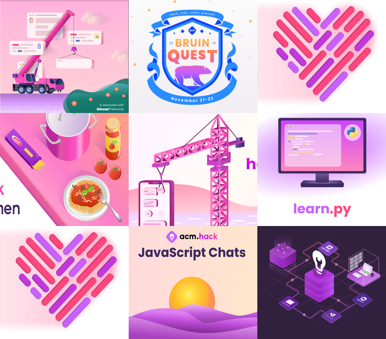

### Fall
* **Bloom: Hackschool**: a collab with [Creative Labs](https://www.creativelabsucla.com/) teaching people web dev and design
* **BruinQuest**: the greatest acm crossover of all time between [Cyber](https://acmcyber.com/), Hack, and [ICPC](https://icpc.uclaacm.com/), featuring a puzzle adventure across a virtual UCLA
* **HackFam**: our family system designed to create connections and friendships to battle quarantine loneliness

### Winter
* **Hack Sprint: React Native**: teaching you how to build some dope mobile apps (on both iOS or Android) with React Native
* **Hack _Off_ the Hill**: our virtual hackathon with the wholesome theme of _Care and Connections_
* **Hack Fam**: part 2. the sequel. we did it again.

### Spring
* **learn.py**: exploring why_snake_case_is_better with python and some fun applications
* **Hack Kitchen**: Gordon Ramsey themed coding competition
* **JSChats**: teaching you why we ~~hate~~ love JavaScript

Not gonna lie, I don't know how we managed to pull it off. At one point, we were spread across 5 time zones (California, East Coast, France, Hong Kong, and India) and communication was tough. There were covid scares, demolished sleep schedules ~~thanks UCLA math for not accommodating our international students~~, last minute moves between school and home, and so much more. In short, these were some ~~wild, stressful, trying, hard, depressing, confusing, worrying~~ _uNPrEceDenTED_ 🤮🤮🤮 times, but we managed to still hold events (and they went well!). 

Saying I'm proud cannot express the overwhelming amount of gratitude I have towards the officers who poured their time and energy into making our events the best they could be. Hack could not have survived the pandemic without these officers and I cannot thank them enough for preventing us from thanos snapping out of existence. 

## our family
What makes being a part of Hack feel special is the energy formed when all of our brain cells come together. Everyone seems to contribute something special--among us there are chefs, boba connoisseurs, weebs, LGBTQ members/allies, and most importantly, people who aggressively argue that vim is better than emacs. From putting together Naruto themed workshops to driving around Westwood to deliver our lofi girl Hack sweaters, there's a special bond that enables us to not only put on fun events, but also give each other support when times get hard.

This year, we also welcomed 6 new interns (who are now all officers!) into our group. They are Eric, Nareh, Einar, Christina, Chandra, and Jakob. The phrase "I love the interns so much" has been brought up in so many calls and I can only wholeheartedly agree. They've brought so much energy (and tiktok followers?) into our team and it seems like they're the missing pieces in a puzzle we didn't know we needed. Many of the officers--myself included--have watched them like proud parents this past year and gushed about how much they've grown up. From the bottom of our hearts we're so excited to see what they'll do in the future because we know they'll grow into amazing people. 

Rather than wrapping up this section with a wholesome message, here's just a few pictures of us this year. These should suffice: 

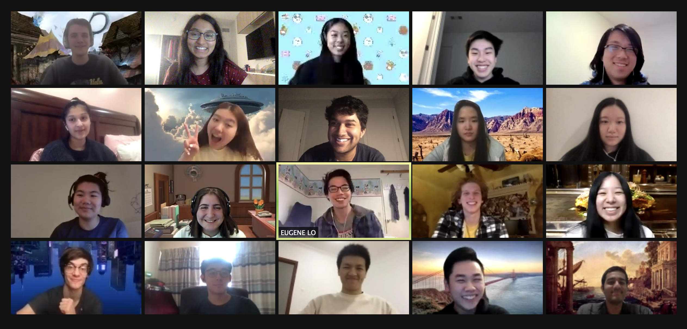

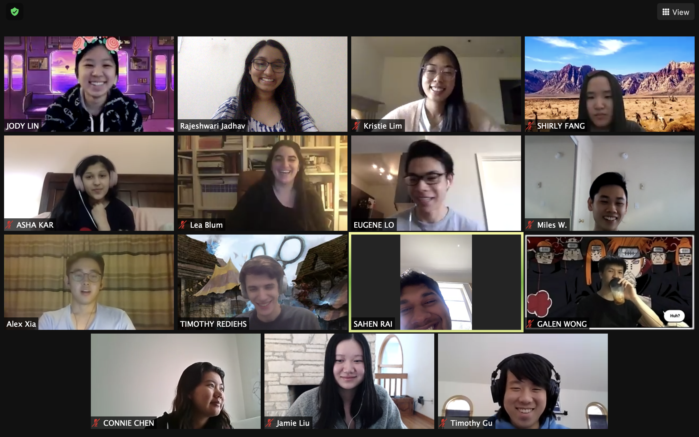

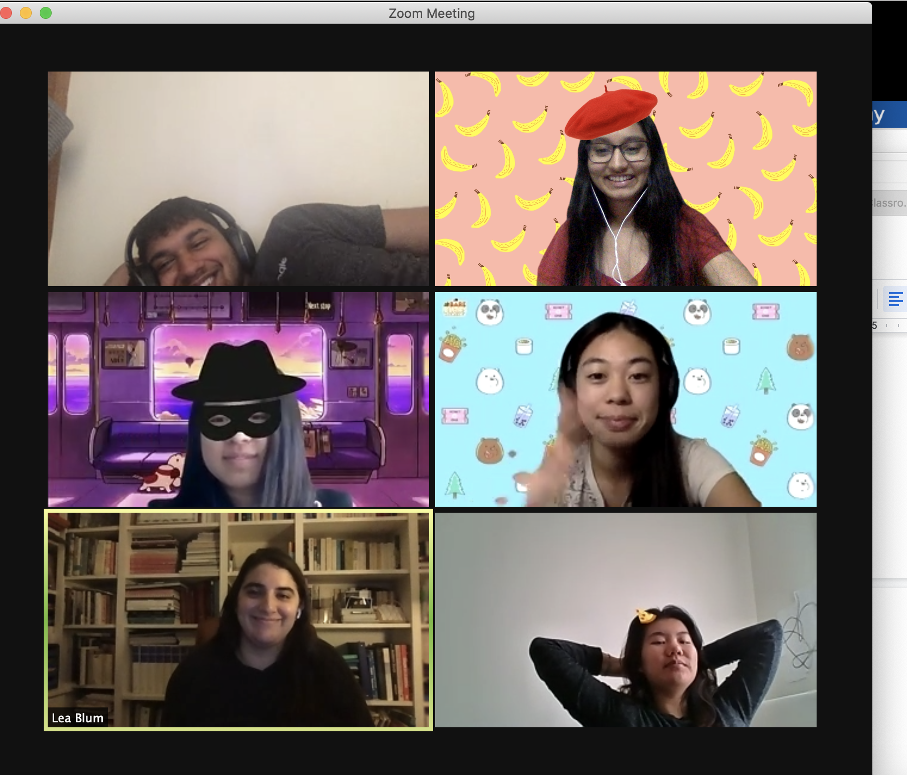

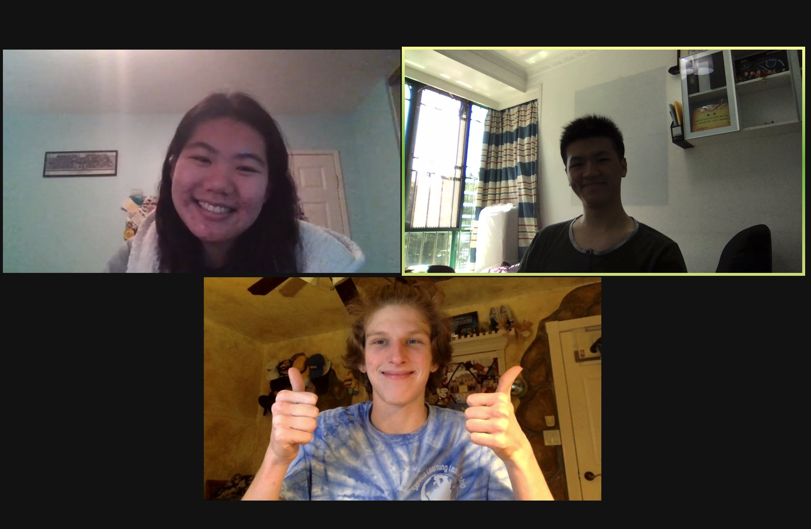

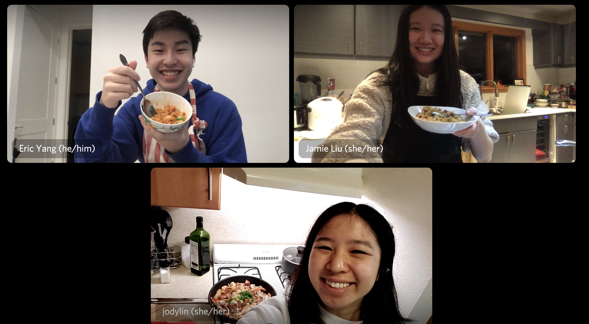

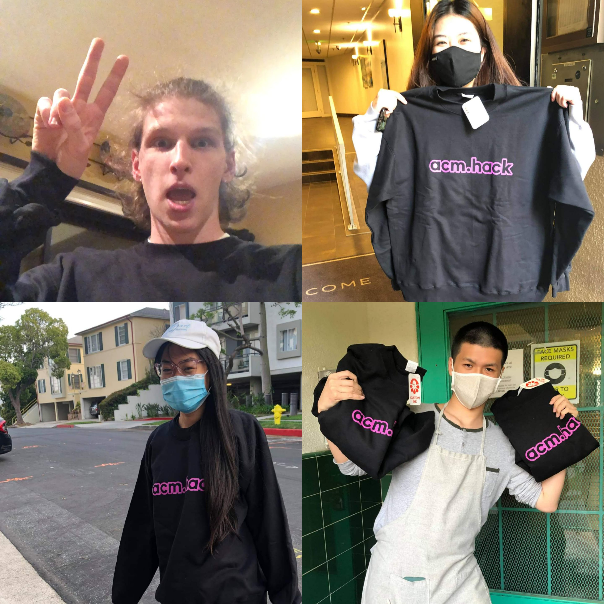

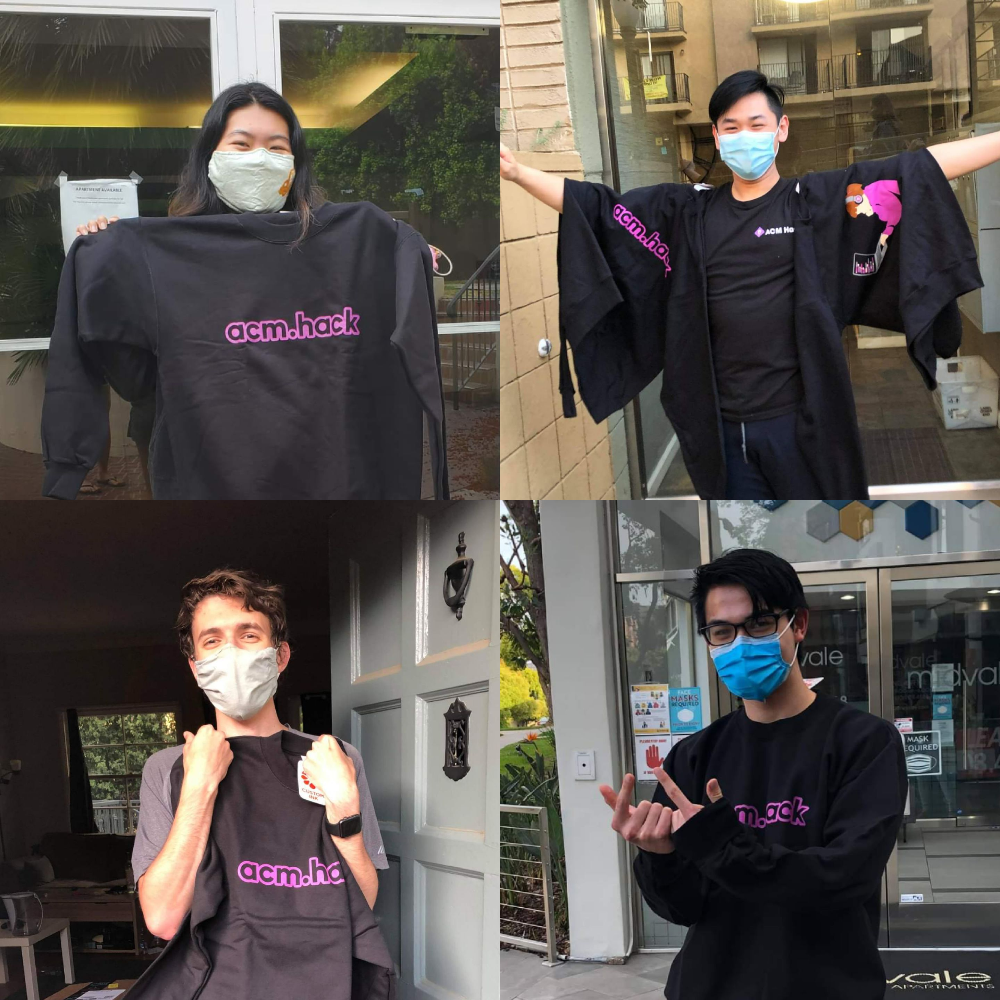

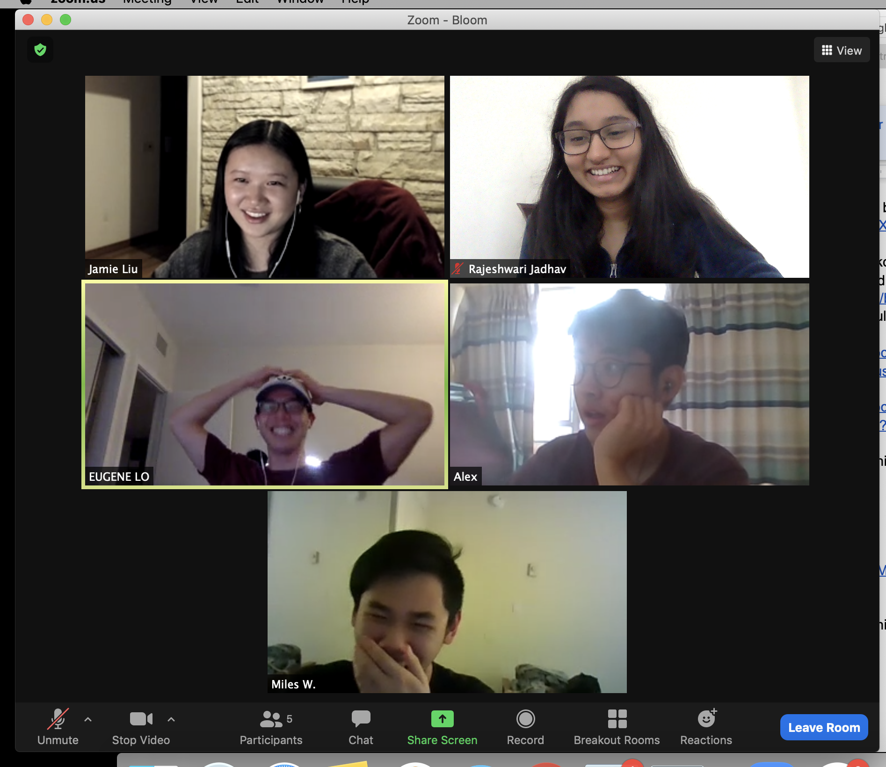

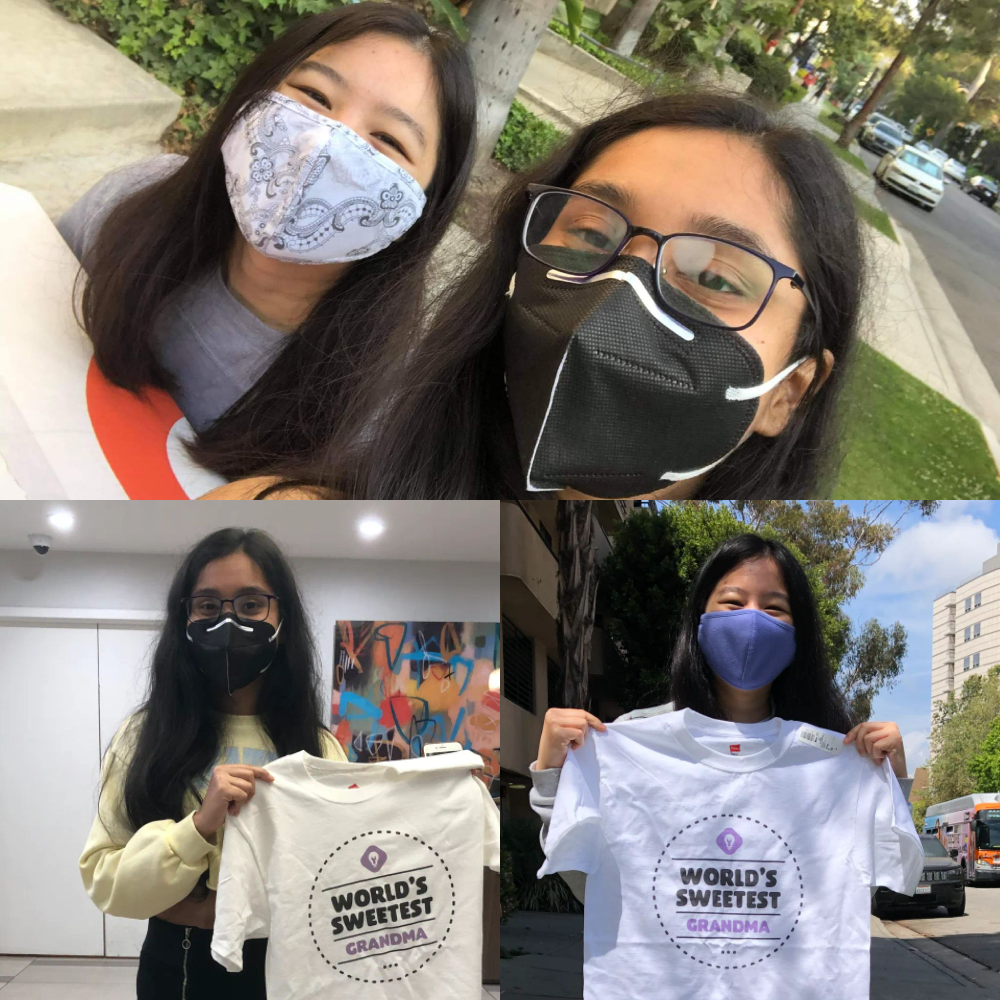

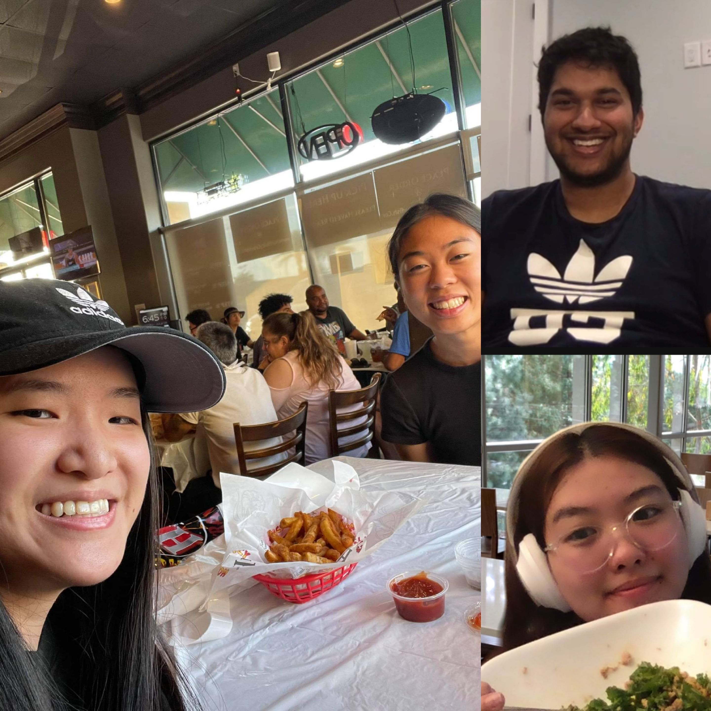

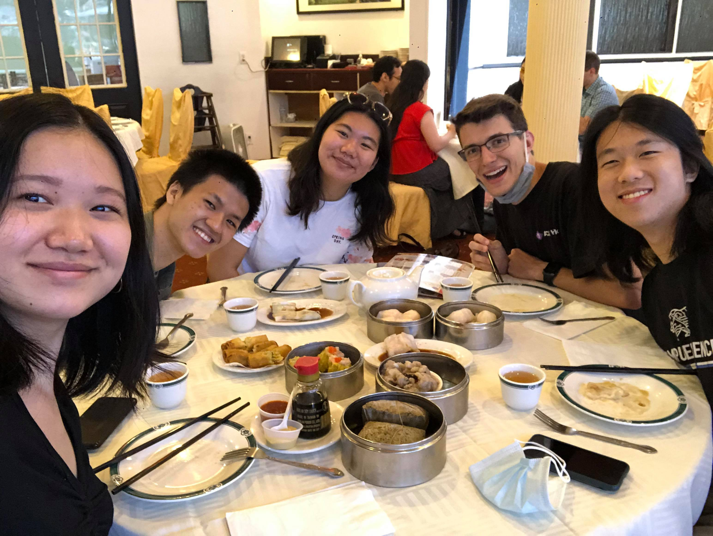

## lessons learned

> _"Good times become good memories, but bad times make good lessons. " - Uncle Iroh_

Although it is heavily debated whether or not 2020 even happened, there is no doubt Hack as a whole came out a little different from 2020 than we did going in. No longer were the days when we'd eat a meal together after workshops and have meetings in our president's living room. No longer were the times when we'd run into each other at the dining halls and have a meal together. No longer were the days we'd spend late crackhead nights together after our events and walk back to our rooms together in the early hours of the morning. 

Zoom university took all that away from us and presented us with a new set of challenges. Despite being oceans apart, we still worked together to make the best of what we had. There was a lot of experimenting and adjusting, but we eventually figured out how to make the virtual format work well for us. Here are just some of the things we learned this year:

1. A 2-week winter break sounded awful in theory and was even worse in real life. 
1. Singing happy birthday over Zoom is better than in person.
1. Record to cloud on Zoom makes the laptop fans go brrrr less.
1. Noctis Lux is the superior VSCode theme.
1. Workshop code-alongs were hard in person. Why did we think it'd be easier over zoom?
1. If Zoom screen share crashes your computer, screen share over Discord and have someone else Zoom screen share your Discord stream. 
1. Friendship is magic and being on opposite sides of the planet cannot keep us apart. 

## a happy ending = new beginnings
June of 2021 finally brought an end to a long year of awkward zoom pauses and that awkward period of time between when you say bye and finally click the _Leave Meeting_ button. As the great Uncle Iroh once said, "You can't always see the light at the end of the tunnel, but if you just keep moving you will come to a better place." We didn't always know what would happen, but we kept moving together until we made it to June. With the vaccine, it seems like we've made it to a better place, but perhaps it's too early to say we've totally made it out. If 2020 taught us anything, it was to ~~keep our expectations low because it just gets worse~~ expect the unexpected. 

Either way, the school year has ended and fall brings a new beginning for us. Will it be a disaster? ~~honestly yes~~ who knows? But we can finally put the last year behind us and look ahead towards the ✨ future ✨. Whatever it will bring, I'm grateful I have this wonderful family by my side. 

So with that I'd like to bid our farewell to the 2020-2021 school year. 

_
By Jody Lin
_
