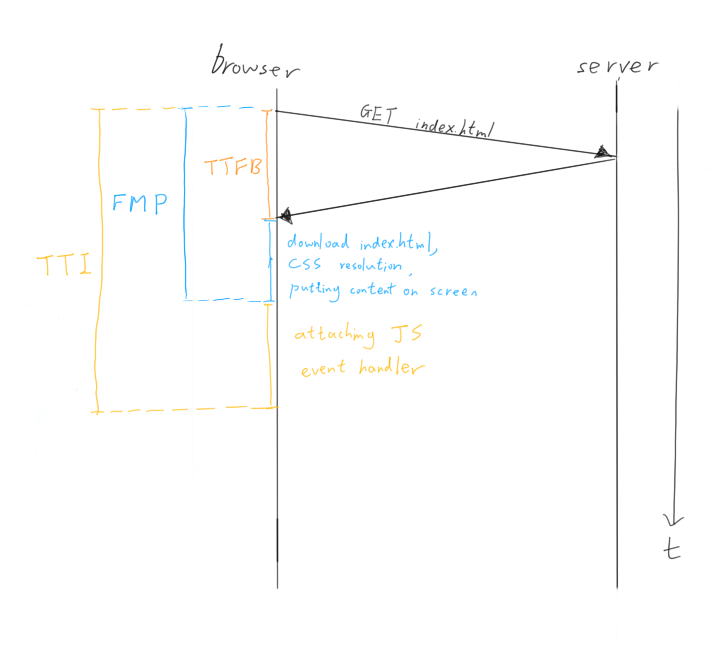
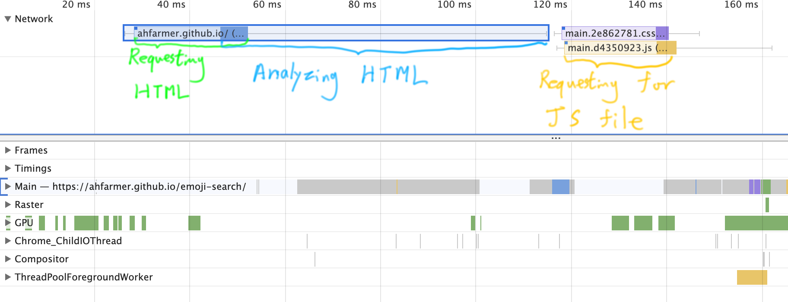
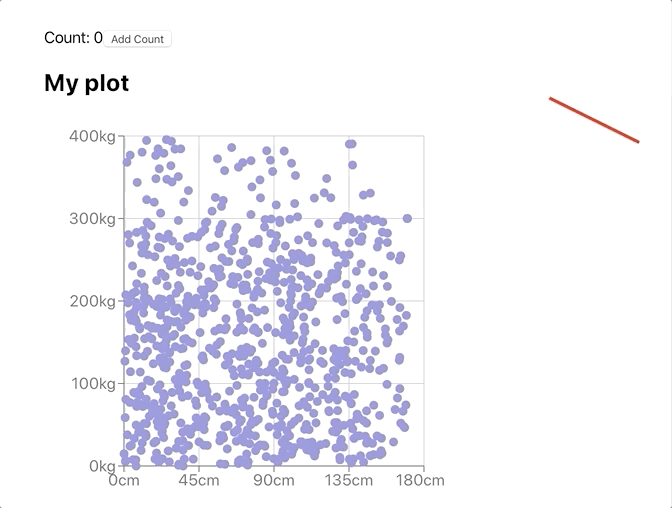
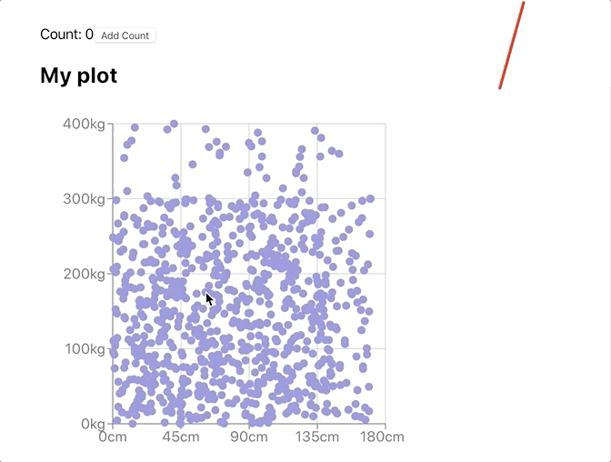
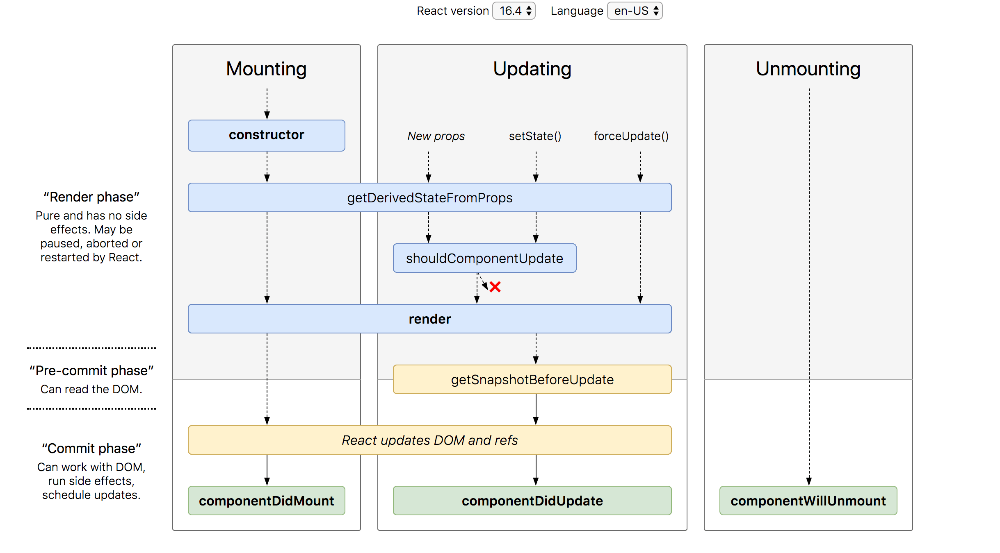
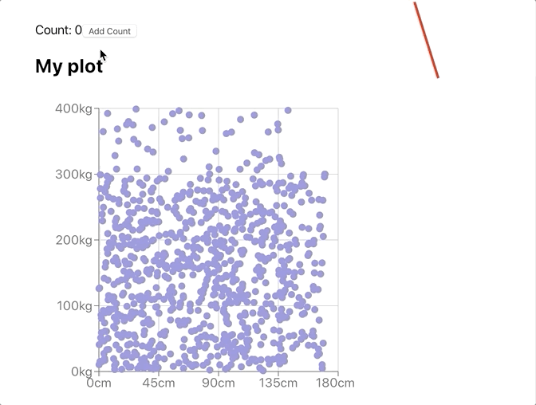

# Optimizing Frontend and React Apps

## JavaScript Chats with ACM Hack Session 4

### November 05, 2019

#### By ACM Hack

- [An Introduction to "Frontend Optimization"](#an-introduction-to-%22frontend-optimization%22)
  - [How Does a Webpage Load?](#how-does-a-webpage-load)
  - [Profiling Performance with Chrome DevTools](#profiling-performance-with-chrome-devtools)
- [Optimizing Initial Rendering of React Application](#optimizing-initial-rendering-of-react-application)
- [Optimizing Runtime of React Application](#optimizing-runtime-of-react-application)
  - [`shouldComponentUpdate` Lifecycle Method](#shouldcomponentupdate-lifecycle-method)
  - [`React.PureComponent`](#reactpurecomponent)
  - [`React.memo` for Function Components](#reactmemo-for-function-components)

## An Introduction to "Frontend Optimization"

When talk about a piece of software, we usually
can optimize it in 2 dimensions.  

- Can we reduce the run time? (time domain)
- Can we minimize memory usage? (space domain)

In the frontend happy land, we usually do not care too much
about memory usage. People are fine (to a certain extent) 
with Chrome eating up all your memory. 


However, we still care about sizes. Larger file size means
higher network latency to download files, which is 
related to the time domain. 

What are parts of a webpage we can optimize then?
To answer that question, we want to know how we measure
"performance" of a webpage. What are some metrics that
we can use? The first instinct is probably

> How fast does our webpage load?

This question is really generic. Where is the starting point 
of our measurement? Where is the ending point of our measurement?
How do we define "finished loading"? We will get into each one 
of them one by one.

### How Does a Webpage Load?

> What happens after you type in a URL in the browser and hit enter?

If you have taken a network class, this is probably one of 
your homework or exam question. Our introductory web development
workshops series Hackschool gives 
[the following answer](https://github.com/uclaacm/hackschool-f19/tree/master/session-1-intro-to-frontend#what-happens-when-you-type-a-url-and-hit-enter): 

> So when you type in a domain name from your computer, you are 
> making a request to a server with that corresponding address.

That is a simple explanation for getting our html file. 
In fact, the time that it takes to get the first byte of the 
html file from the server starting from the moment you 
hit enter is called __time to first byte__ (TTFB). 
This is one of the metrics that we can use to measure
the performance of a webpage. 

However, this is not enough, getting the first byte does 
not necessarily mean that the user can actually see the 
page. The browser has to first download the entire html file,
then combine it with style information (CSS) to render it
on the screen. This process of downloading and processing
takes time. The time taken until the content is visible 
to the user is __first meaningful paint__ (FMP). 
This is a better metrics than TTFB since TTFB really only
depends on how good the network is, but FMP takes into 
consideration of time taken to render/draw the page.

Drawing a page does not mean all the interactive functionality
works, which includes clicking buttons or user inputs. 
We know that JavaScript is what makes a webpage interactive. 
Therefore, the time to get the page interactive is the time
to run all the JavaScript and attaching all necessary event
handlers to each HTML DOM node. This time is called
time to interactive (TTI).

In summary, the 3 metrics can be summarized in the following
diagram. 



Do not get deceived by the diagram. Here is a question for you:

> In what situation will TTI equal FMP?

### Profiling Performance with Chrome DevTools

We have just looked at some metrics that we can use.
With the help the Chrome DevTools, we can profile a webpage 
easily. Open Chrome DevTools and go to the "Performance" tab.
If you hit the circle button on the top left corner, 
you can profile the current web page. 
What Chrome will do is that it reloads the webpage and
tries to time things. 


For a complete guide on how to use the Performance tab, read 
[Google's official introductory article](https://developers.google.com/web/tools/chrome-devtools/evaluate-performance).

The Performance tab focuses on benchmarking our website
from a developer/programmer's perspective, where we look
at numbers like TTFB, CPU time distribution, memory 
usage, time for each call stack, network requests waterfall,
etc. These all focus on speed, but there are other
parts of user experience. How readable are the text on the
background? How accessible is our website for user that
uses the accessibility features in the browser? 
How search engine friendly is our website? 

To measure these performance, we use the "Audit" tab.
Read the official guide 
[here](https://developers.google.com/web/tools/lighthouse#devtools).

## Optimizing Initial Rendering of React Application

The rendering process of a React application is very
different from a static site. 
Take for example, the emoji search web application:
https://ahfarmer.github.io/emoji-search/. 
If we go to the network tab in Chrome DevTools, 
we can see the first html file being requested. 
Here is the response body (prettified):

```html
<!DOCTYPE html>
<html lang="en">
  <head>
    <meta charset="utf-8">
    <meta name="viewport" content="width=device-width,initial-scale=1">
    <link rel="manifest" href="/emoji-search/manifest.json">
    <link rel="shortcut icon" href="/emoji-search/favicon.ico">
    <title>Emoji Search </title>
    <link href="/emoji-search/static/css/main.2e862781.css" rel="stylesheet">
  </head>
  <body>
    <noscript>You need to enable JavaScript to run this app.
    </noscript>
    <div id="root"></div>
    <a class="github-fork-ribbon" href="https://github.com/ahfarmer/emoji-search" title="Fork me on GitHub">Fork me on GitHub</a>
    <script type="text/javascript" src="/emoji-search/static/js/main.d4350923.js"></script>
  </body>
</html>
```

This file does not contain whatever content should be on the page.
It only contains an `a` tag and nothing else. 
What happened to the rest of the content that we see in the browser?
Remember that everything written within React is actually in the 
space of JavaScript, not in the space of HTML. 
Our React application is actually sitting in the script at the end 
of the file. What is the implication of this?

From the timeline in the Performance tab, we can see that the 
request for the javascript file only fired after the request
for HTML and after the browser has finished analyzing the 
HTML file for tags. 



This is bad. This means that for our React Application to show up on screen,
we will at least need two round trips to the server. 
After the receiving the JavaScript file, we still have to run the code
in order to have our Application mounted. That takes up time as
well and it delays our FMP. 
For such an simple example application, it might not be too much 
of an issue if you are on a desktop computer and a good network.
However, if you are on mobile with lower CPU processing speed,
it will take much longer to run the React file and mount your
web application on. If your network is slow, the 2 round trips
will significantly increase FMP as well. 

To solve this issue, we can inline our React script in the HTML file, 
and therefore reducing time for networking. Note: if you use 
create-react-app, the script is usually by default inlined.

This does not solve the issue of time taken to run the JavaScript 
file. In that case, we might want to switch to server side rendering.
We will not go into the details of server side rendering here,
since there are a lot of different abstraction and different 
use cases that requires different types of server side rendering.

> What are the issues of server side rendering? 

## Optimizing Runtime of React Application

Let's say we have simple application that has the following
structure. 

```jsx
function App() {
    const [count, setCount] = useState(0);
    const increment = () => { setCount(count + 1) };
    return (
        <div>
            Count: {count}
            <button onClick={increment}>Add Count</button>
            <MyChart title="My plot" />
            <MyClock />
        </div>
    );
}
```


Look at the `MyChart` component. We can see that it is 
a very heavy component. Since it has to draw a lot of 
points on the graph, which probably takes a lot of time
for rendering. 
Now think about what happens when we click the 
button to increment the counter.
React is going to render the `App` component 
since the state has been changed. 
That also means that React has to render the 
child nodes of `App`, which include the `button`,
`MyChart` and `MyClock`.

Here is the implementation of `MyChart`:
```jsx
class MyChart extends React.Component {
  render() {
    return (
      <div>
        <h2>{this.props.title}</h2>
        <Charts />
      </div>
    );
  }
}
```

The `Charts` component is what actually draws the plot.
Assuming that `Charts` is pure (stateless) and all the 
data is constant. What is the implication of this?
Let's try to click on the button.



We see that the clock freezes. Since JavaScript is single
threaded, any operation that takes up the CPU is going
to block other operation. In this scenario, React's process
of rendering the component is blocking. This is called
__render blocking__. When we click on the button, 
state is updated, `App` component and all its children is 
re-rendered. Rendering takes up the CPU time therefore we
cannot update the animation of the clock since it is blocking. 

### `shouldComponentUpdate` Lifecycle Method

However, as application developer, we know `Charts` is static 
and `MyCharts` do not need to update if we do not change
`props.title`. Can we prevent React from re-rendering the 
`Charts` and just use the previously rendered version?
In fact, there is a lifecycle method called
`shouldComponentUpdate` to help you.

Here is how we use `shouldComponentUpdate`:

```jsx
class MyChart extends React.Component {
  shouldComponentUpdate(prevProps, prevState) {
    if (prevProps.title === this.props.title) {
      return false;
    }
    return true;
  }
  render() {
    return (
      <div>
        <h2>{this.props.title}</h2>
        <Charts />
      </div>
    );
  }
}
```

`shouldComponentUpdate` takes in 2 parameters, 
the previous version of props as `prevProps` and the
previous version of state as `prevState`.
If the method returns `true`, that means the component
should update and React is going to re-render the component. 
Otherwise, the component will not be re-rendered.

In `MyChart`, the condition to not re-render is that
if our `title` in the previous props and in our current
`props` is the same. If they are the same, we return
`false`.

> Why can't we directly do the comparison of `prevProps === this.props`?

<details>
  <summary>Click to view answer</summary>

  In JavaScript, when objects are being compared, we are 
  comparing their reference. In other words, we are comparing
  the pointer that points to the object. If the 2 objects
  sit in the same place in memory, the comparison gives `true`.

  However, `prevProps` and `this.props` are two different objects
  at different location in memory. Even if the underneath value
  is the same, we still get `false` when comparing them.
</details>




We see that `shouldComponentUpdate` is called right before 
`render` when a component is updating. 
We "bail out" from rendering using `shouldComponentUpdate`.

Let's retry our demo with the optimization applied.



This is nice, but also tedious. 
What you have a really long list of props? 
Then you might need to manually compare each of them!
Sure you can write a for-loop to help you do that.

### `React.PureComponent` 
```jsx
shouldComponentUpdate(prevProps, prevState) {
  // compare number of keys
  if (Object.keys(prevProps).length !== Object.keys(this.props).length)
    return true;

  // compare value of keys
  for (const key of this.props) {
    if (prevState[key] !== this.props[key])
      return true;
  }
  return false;
}
```

But you have to copy this code for each and every component
that you are optimizing. That is tedious. However, React
provides you with a nice way of skipping this boilerplate.
Instead of `React.Component`, we use `React.PureComponent`.

```jsx
class MyChart extends React.PureComponent {
  render() {
    return (
      <div>
        <h2>{this.props.title}</h2>
        <Charts />
      </div>
    );
  }
}
```

Just as the name suggest, whatever component that you
build with `PureComponent` should be pure. That means
the render should return the same tree of component
given the same state and props.

> In what situation will choose to implement our own 
> `shouldComponentUpdate` instead of using `PureComponent`?

### `React.memo` for Function Components

What if our component is a function component? We cannot
use the lifecycle hook. React provides us with `React.memo`
to go around that issue.

```jsx
const MyChart = React.memo(({ title }) => {
  return (
    <div>
      <h2>{title}</h2>
      <Charts />
    </div>
  );
});
```

`React.memo` takes in a function component, and check 
if the props and state changes over each render. 

> With class component, can you implement a simple version
> of `React.memo` that only check if the `props` have updated
> over each render? (No need to check for `state` change)

<details>
<summary>
Click to view solution
</summary>

The general idea is to take a component, put a wrapper
around it, and "hijack" its props. 
```jsx
function memo(FuncComponent) {

  class MemoizedComponent extends React.Component {
     shouldComponentUpdate() {
      // compare number of keys
      if (Object.keys(prevProps).length !== Object.keys(this.props).length)
        return true;

      // compare value of keys
      for (const key of this.props) {
        if (prevState[key] !== this.props[key])
          return true;
      }
      return false;
    }
    render() {
      return <FuncComponent {...this.props} />;
    }
  }

  return MemoizedComponent;
}
```

You can get lazier, using `PureComponent`.

```jsx
function memo(FuncComponent) {

  class MemoizedComponent extends React.PureComponent {
    render() {
      return <FuncComponent {...this.props} />;
    }
  }

  return MemoizedComponent;
}
```

But this cannot check for the `state` change in 
`FuncComponent`. That is doable but is going to be harder. 
If you want to try, look into React `ref`. 

</details>

