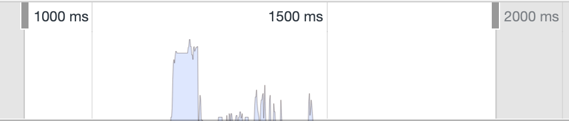

# Node.js Profiling

## JavaScript Chats Hack Session 2 Spring 2021

### April 04, 2021

#### By ACM Hack

In the previous [JS Chats on optimization](/posts/fall2019/js-chats-4), we took
a peek at the Chrome DevTools and how we can use the Performance tools to
profile our web application loading time. Since both Node.js and Chromium both
rely on the [V8 engine](https://v8.dev/) and adhere to the [Chrome DevTools
protocol](https://chromedevtools.github.io/devtools-protocol/), the DevTools in
Chrome can actually be a debugger and a profiler for Node.js as well! Let's see
how we can use it.

Here, we built a very simple sever program, with one API endpoint to get some
cryptocurrency prices.

```js
app.get('/coin-prices', async (req, res) => {
	const listOfCoins = [
		'dogecoin',
		'bitcoin',
		'ethereum',
		'polkadot',
		'litecoin',
		'cardano',
		'bitcoin-cash',
		'stellar',
		'chainlink',
		'binancecoin',
	];

	const prices = {};
	for (const coinId of listOfCoins) {
		prices[coinId] = await getCoinPrice(coinId);
	}
	res.json(prices);
});
```

The full server program can be found here:

> https://github.com/uclaacm/js-chats-s21/tree/main/node-profile

The endpoint uses a list of coin IDs, queries their prices against an external
API `getCoinPrice`, and return them as a JSON object. For those who has worked
with async programming in JavaScript before, you might have already noticed the
bad performance pattern. If not, don't worry. We will show where the bad spot
is and how to optimize it. Let's try to profile this.

To allow for profiling, we invoke the server program with the `--inspect` flag.

```bash
node --inspect index.js
```

The terminal outputs the following

```
Debugger listening on ws://127.0.0.1:9229/9b78b923-925f-462c-8dca-345b3b6f9f38
For help, see: https://nodejs.org/en/docs/inspector
```

This means the profiler and debugger has been invoked. Now, we head to Chrome
and open DevTools (right click anywhere and click inspect). On the top left corner,
a Node.js icon is going to pop up.


After we click on it, the Node.js profiler will pop up.


The tabs are:

- **Connection**: choosing which Node.js instance to connect to
- **Profiler**: capture and inspect CPU profile for Node.js instance
- **Console**: look at output from `console.log` from the Node.js instance
- **Sources**: the debugger interface
- **Memory**: capture memory snapshot

We will focus on the Profiler tab.

## Profiling Node.js

We have one endpoint and let's take a look at its performance.
The steps we are going to take for profiling are:

1. Start the profiling
2. Send a request to our app
3. End the profiling

To start the profiling, we click the "record" button on the top left.


Then, we need to send a request to our server. You can do it in whatever ways:
the browser, Postman, curl… I am just going to use curl here:

```bash
curl localhost:3001/coin-prices
```

After we get our response back, we stop the profiling by hitting the record
button again. Then, a profile will have been captured. To see a visualization of the
call stack, select the "Chart" option from the top selector.


They way you interpret this is the same as how you would interpret the timeline
for profiling our web application. Notice how our program exhibit peaks in the
call stack! This is indicative of the performance issue with our API. Our
request took almost 2000 ms to finish (the distance from the first peak to
the last peak), which is pretty slow for a simple endpoint.

If we zoom into one of the peak, we realize that our server is handling one of our API calls!


> Tip: you can use <kbd>Ctrl</kbd>+<kbd>F</kbd> or <kbd>⌘F</kbd>
> to search for a named function in the call stack.

The culprit here is the serial handling of our request to get the prices of the cryptocurrencies. The `for` loop `await`s for one API call to be done before making the next one!

```js
for (const coinId of listOfCoins) {
	prices[coinId] = await getCoinPrice(coinId);
	// wait for it to be done, before we can start the next one
}
```

This is a waste of time. We could have started all the request at once, and
collect the result all together.

```js
const prices = {};
await Promise.all(
	listOfCoins.map(async id => {
		prices[id] = await getCoinPrice(id);
	})
);
```

Let me explain the code. For each of the coin ID, we call an `async` function
on it. The function takes the coin ID and get its price to put it in the
`prices` object. You might ask, isn't this still calling `await` in a loop?
Not exactly. Imagine how `map` calls the function:

```js
// imaginary `map` function
function map(func) {
	const results = [];
	for (const item of this) {
		results.push(func(item));
	}
	return results;
}
```

`map` does not `await` for the given `func`. Remember that `async` function
returns a `Promise`. `map` iterates through the list of coin IDs, kicks off one
`async` function call for each coin, and collects each `Promise` returned from the
`async` function. Therefore, the output of `map` is an array of `Promise`s.
Using `Promise.all`, we turn the array of `Promise`s into one single `Promise`,
which only resolves when all the `Promise`s in the array are resolved, i.e.,
all the API calls are finished.

With the new piece of code, we are making the requests for the prices all at
once so they run in parallel.


After the optimization, we take another profile snapshot.



The distance between the first peak and the last peak dropped to under 400 ms. That's a 5× speed-up!

If we take a close look at the first peak of the call stack, we can see that
there are multiple request being sent back to back, meaning
that the requests are fired together.


In the real world, optimization is not just looking for loops with `await` in
them. It is more complex than this. However, knowing how to profile and seeing
how CPUs are consumed in your application definitely helps you in optimizing
the application.

The complete implementation of the optimized program can be found in the following repository:

> https://github.com/uclaacm/js-chats-s21/tree/main/node-profile
