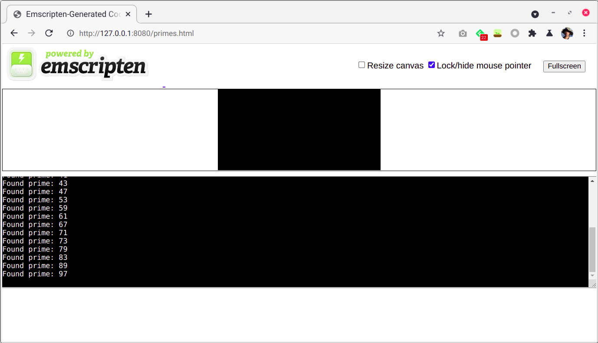
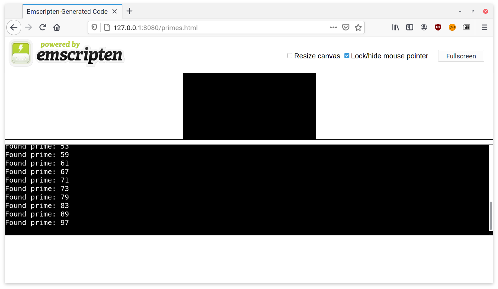

# Introduction to WebAssembly

## JavaScript Chats Hack Session 5, Spring 2021

### May 04, 2021

#### By ACM Hack

We usually associate the browser with the language JavaScript. The browser,
such as Google Chrome, takes the JS code and then executes its instructions
such as performing calculations or manipulating elements of the DOM. For
Chrome, the "engine" that executes JavaScript is called **V8**. But V8 is not
just a JavaScript engine! It can also run another language called
**WebAssembly**.

Side note: historically, JavaScript was not always the main language of the
web! Java used to be the hot new language to be run from browsers as applets.
JavaScript was named after Java and ride off the hype as a scripting
alternative. Check out [this
article](https://www.vice.com/en/article/8q8n3k/a-brief-history-of-the-java-applet)
for more.

Disassembled WebAssembly looks like this:

```wasm
(func $dot (type 0) (param i32 i32) (result f32)
  (f32.add
    (f32.add
      (f32.mul
        (f32.load
          (local.get 0))
        (f32.load
          (local.get 1)))
      (f32.mul
        (f32.load offset=4
          (local.get 0))
        (f32.load offset=4
          (local.get 1))))
    (f32.mul
      (f32.load offset=8
        (local.get 0))
      (f32.load offset=8
        (local.get 1)))))
```

Similar to x86 assembly code, you will pretty much never write WebAssembly code
by hand. Instead, you use a higher level language such as C, C++, Rust, etc.,
and compile it into WebAssembly. AssemblyScript is a variant of TypeScript
designed to compile into WebAssembly. You can't directly compile JavaScript
into WebAssembly since there aren't any types. However, you can call JavaScript
code from WebAssembly so they work well together. Anything JavaScript can do,
WebAssembly can also do but you don't have to use just one or the other.

## Why would you use WebAssembly?

JavaScript is usually just fine, and many engineers have worked on the V8
JavaScript engine so that it runs pretty fast. Even though JavaScript is
traditionally an interpreted language, V8 uses "just in time" compilation to
turn the JavaScript code into fast machine code (x86, ARM, etc.) dependent on
the physical machine it is being run on. However because JavaScript is
dynamically typed, there are limitations to its performance. The following
explanations are summarized from [this excellent
article](https://surma.dev/things/js-to-asc/index.html) by Surma.

V8 needs to warm up before generating the fast low-level machine code. In order
to start executing as fast as possible, V8 starts by running the JavaScript
code through the interpreter. Then it observes executing code for the object
shapes (which can be thought of as types). Once enough data is collected, then
it can begin the just-in-time compilation for faster execution. WebAssembly
does not need this initial warmup time.

In addition because types are dynamic in JavaScript, it's possible that the
compiled machine code has the incorrect type later on. For example, maybe a
function took in an integer at first but later on an object was passed into the
same function. In this case, the compiled machine code cannot be used anymore
and the JavaScript execution will fall back to the slower interpreter.

Since WebAssembly is typed, it does not have these problems so you can get more
reliable performance. In addition, WebAssembly has a more compact binary format
than JavaScript (which is in text format) and is easier to parse since the
rules are not as complex.

For performance intensive applications such as 3D games, VR/AR, image/video
editing, or computer vision, using WebAssembly can have a lot of benefits. For
example,
[Figma](https://www.figma.com/blog/webassembly-cut-figmas-load-time-by-3x/)
used WebAssembly to cut their load time by 3x all the way back in 2017 when
WebAssembly was just getting started.

## Principles of WebAssembly: Speed, Safety, Interoperability

If we want performance, why not just let browsers run C? C is a low-level
language. It's close to machine code and used in applications where performance
is very important. While it is possible, another major principle of WebAssembly
is **safety**. C has a lot of undefined behaviors and gives you a lot of power
to manipulate memory in a machine. WebAssembly has no undefined behaviors and
prevents you from accessing memory outside of your current tab. Another
principle of WebAssembly is **interoperability**. C has many OS and CPU
specific APIs that are not desirable for a browser. The execution of C also
depends on the compiler that you use among other factors. An important part of
WebAssembly is that it can be run exactly the same way on any browser, any OS,
and any hardware.

## Demo

As a demo today, we will be writing a program today to compute primes. The
program will be written in C, but we will compile it to WebAssembly to allow it
to be run across different browsers.

Our demo code is available on GitHub at
https://github.com/uclaacm/js-chats-s21/tree/main/webassembly.

### Dipping our feet into the water

Here's the C code for finding all primes less than a particular number. We will
name this file `primes.c`.

```c
#include <stdbool.h>
#include <stdio.h>
#include <stdlib.h>
#include <string.h>

// FindAllPrimes sets a[p] to true for every prime p < max,
// and set all other a[i] to false.
// a is expected to have length max.
void FindAllPrimes(bool* a, int max) {
  // 0 and 1 are not primes.
  a[0] = false;
  a[1] = false;

  // Sieve of Eratosthenes: first consider all numbers prime, but reverse
  // that decision once we find a way of getting that number through
  // multiplication.

  for (int i = 2; i < max; i++) {
    a[i] = true;
  }

  for (int i = 2; i < max; i++) {
    if (i * i > max) {
      break;
    }
    if (a[i]) {
      for (int j = i * i; j < max; j += i) {
        a[j] = false;
      }
    }
  }
}

// PrintPrimes prints all primes up to (but not including) max.
void PrintPrimes(int max) {
  bool* a = malloc(max * sizeof(bool));
  FindAllPrimes(a, max);
  for (int i = 0; i < max; i++) {
    if (a[i]) {
      printf("Found prime: %d\n", i);
    }
  }
}

int main(void) {
  PrintPrimes(100);
}
```

Since the `main` function contains `PrintPrimes(100)`, compiling and running
this file using a C compiler will print out all primes between 2 and 100.

Now we will use a tool called [Emscripten](https://emscripten.org/) to compile
this C file into WebAssembly. Emscripten actually supports multiple use cases:
running your code in Node.js versus in a web browser. We will set the "output"
file name to be an HTML file, which actually supports both Node.js and the
browser.

```bash
❯ docker run           \
  --rm                 \
  -v $(pwd):/src       \
  -u $(id -u):$(id -g) \
  emscripten/emsdk     \
  emcc primes.c -o primes.html
```

After running this command, you should see three new files:

```
❯ ls
primes.c  primes.html  primes.js  primes.wasm
```

The `wasm` file contains the actual compiled functionality. Unfortunately, we
can't run the `wasm` file directly; instead, we also need the `js` file
contains some "glue code" that tells the JavaScript engine _how_ to run the
`wasm` file. Finally, the `html` file wraps the `primes.js` file to allow
running the program in the browser.

We can first try to run `primes.js` with Node.js.

```
❯ node primes.js
Found prime: 2
Found prime: 3
Found prime: 5
...
Found prime: 97
```

Seems to work!

Running the program in the browser proves a bit trickier. Merely opening the
HTML file doesn't work, as it's stuck at the "preparing" stage forever.
Instead, we need to launch an HTTP server in the current directory<sup>[[1]](#footnote-1)</sup> (we use
[http-serve](https://www.npmjs.com/package/http-serve) for this purpose):

```
❯ http-serve .
Starting up http-serve for .
Available on:
  http://127.0.0.1:8080
  http://192.168.1.133:8080
Hit CTRL-C to stop the server
```

Then, visiting http://127.0.0.1:8080/primes.html works like a charm!





<sup id="footnote-1">[1]</sup> See the Emscripten [“Why does my program stall
in ‘Downloading…’ or ‘Preparing…’?”](https://emscripten.org/docs/getting_started/FAQ.html#how-do-i-run-a-local-webserver-for-testing-why-does-my-program-stall-in-downloading-or-preparing)
FAQ entry.

### PrintPrimes: Using ccall and cwrap helpers

So… that was pretty cool, but how can it be useful? All we can do right now is
finding primes less than 100. Ideally, we would have a way of integrating the
compiled WebAssembly code into an existing JavaScript application, so that we
can find primes of any size.

More concretely, by default Emscripten automatically creates a `primes.js` file
that runs the `main` function. But we want to have a way of running the
PrintPrimes and FindAllPrimes function ourselves.

The first thing we need to do is to tell Emscripten that we are interested in
running the functions ourselves.

```bash
❯ docker run                                                   \
  --rm                                                         \
  -v $(pwd):/src                                               \
  -u $(id -u):$(id -g)                                         \
  emscripten/emsdk                                             \
  emcc                                                         \
    -s MODULARIZE                                              \
    -s EXPORTED_FUNCTIONS='["_FindAllPrimes", "_PrintPrimes"]' \
    -s EXPORTED_RUNTIME_METHODS='["ccall", "cwrap"]'           \
    primes.c -o primes.js
```

Whoa! What's going on here? It turns out that to achieve what we want, we need
to pass three different flags through `-s`:

1. `MODULARIZE`, which creates a Node.js module file that we can easily reuse.
2. `EXPORTED_FUNCTIONS`, which defines which C functions we are interested in
   calling. Note, we have to include a leading underscore `_`.
3. `EXPORTED_RUNTIME_METHODS`, which asks Emscripten to include the `ccall()`
   and `cwrap()` helper functions.

Finally, we also need to change the extension of `primes.html` to `primes.js`.

---

After this is done, we can now write our own JavaScript code. We will call this
file `primes-cwrap.js`. Here it is:

```js
'use strict';

const initializeWasm = require('./primes.js');

(async () => {
	const Module = await initializeWasm();

	const printPrimes = Module.cwrap('PrintPrimes', 'void', ['number']);

	printPrimes(200);
})();
```

First, the `primes.js` file now exports an "initializer" function that returns
a promise, so we need to `await` it before doing anything further.

Then, we need to call a function called `cwrap`. It helps do some type
conversion, like converting JavaScript string to an array of ASCII/UTF-8 bytes
and vice versa.

Finally, we can now call the `printPrimes` function – as if it was written in
JavaScript!

Running the `primes-cwrap.js` file in Node.js produces the expected results:

```
❯ node primes-cwrap.js
Found prime: 2
Found prime: 3
Found prime: 5
...
Found prime: 199
```

---

There is also another helper Emscripten provides called `ccall`. Unlike
`cwrap`, it allows you to call C functions in a single line:

```js
'use strict';

const initializeWasm = require('./primes.js');

(async () => {
	const Module = await initializeWasm();

	Module.ccall('PrintPrimes', 'void', ['number'], [200]);
})();
```

We personally found `ccall` to be less readable than `cwrap` though.

### FindAllPrimes: Calling C functions directly

We see that `ccall` and `cwrap` have given us more control over running
compiled WebAssembly code, but it still feels awkward to use in JavaScript. In
particular, it prints out the primes directly without letting us use the
numbers. What we really want to do is have a JavaScript function
`findAllPrimes` that takes `max` and returns an array of primes.

```js
function findAllPrimes(max) {
	const primes = [];
	// ...
	return primes;
}
```

Unfortunately, calling FindAllPrimes proves to be a bit tricky. The function
signature of `FindAllPrimes` is

```c
void FindAllPrimes(bool* a, int max);
```

The first argument is a _pointer_ to a boolean, which is a _memory address_ –
and sadly, `ccall` and `cwrap` don't support pointer types.

To fix this, we need two ingredients:

#### Direct calls

It turns out that Emscripten also allows **direct calls** to the WebAssembly
function. So for the previous example, we could have really done:

```js
const Module = await initializeWasm();
Module._PrintPrimes(200);
```

This gives us another way of calling C functions, bypassing `ccall` and `cwrap`
(which don't support pointers). But we still need a second ingredient of
actually acquiring a memory address.

#### Allocating memory

Where we are stuck now is: how on earth can we create a valid pointer value to
pass to `FindAllPrimes`? We can't just make some number up, as it could already
be occupied by other parts of the program.

The solution here is to call into the `malloc()` and `free()` C functions. As a
refresher, in C, the `malloc()` functions take a number of bytes and returns
the address to a newly allocated block of memory. When we are done with that
block of memory, we can allow C to use it for other purposes by calling
`free()`.

With this knowledge, we can then build a new `primes.js` file that exposes
`malloc()` and `free()`:

```bash
❯ docker run                                                                       \
  --rm                                                                             \
  -v $(pwd):/src                                                                   \
  -u $(id -u):$(id -g)                                                             \
  emscripten/emsdk                                                                 \
  emcc                                                                             \
    -s MODULARIZE                                                                  \
    -s EXPORTED_FUNCTIONS='["_FindAllPrimes", "_PrintPrimes", "_malloc", "_free"]' \
    -s EXPORTED_RUNTIME_METHODS='["ccall", "cwrap"]'                               \
    primes.c -o primes.js
```

Then, we can take advantage of `malloc()` and `free()` to write
`primes-direct.js`:

```js
'use strict';

const initializeWasm = require('./primes.js');

async function findAllPrimes(max) {
	const Module = await initializeWasm();

	// Allocate an array of `max` booleans.
	const ptr = Module._malloc(max);

	// Call FindAllPrimes.
	Module._FindAllPrimes(ptr, max);

	// For each i, check if the boolean is false (0) or true (anything else).
	// If it's not 0, then add i to the primes array.
	const primes = [];
	for (let i = 0; i < max; i++) {
		if (Module.HEAP8[ptr + i] !== 0) {
			primes.push(i);
		}
	}

	// We need to free the memory we allocated earlier before returning.
	Module._free(ptr);

	return primes;
}

(async () => {
	console.log(await findAllPrimes(300));
})();
```

> Stop and think. What could go wrong with this code?
>
> - What if we call `findAllPrimes(0)`? or `findAllPrimes(-1)`? or
>   `findAllPrimes({ key: 42 })`?
> - What if `max` is very large? What would `Module._malloc` return?
> - What if `primes.push` somehow throws an exception? What happens to `ptr`?
> - What if each C boolean actually requires two bytes?
> - What if we end up calling `initializeWasm` many, many times?

We tried to fix some of these problems and make our code more robust, in
[primes-direct-robust.js](https://github.com/uclaacm/js-chats-s21/blob/main/webassembly/primes-direct-robust.js),
which unfortunately complicates the code quite a bit.

## Conclusion

Our demo today exposes some of the problems with using WebAssembly. If you are
calling into WebAssembly functions from JavaScript, many times you would be
forced to essentially write code in that other language (C, C++, or anything
else) but in JavaScript, and to deal with the same problems as the original
language (e.g., memory allocation and cleanup). We think it is good practice to
do **as much as possible** in the source/compiled language, and to **minimize
the interface** between JavaScript and WebAssembly.
