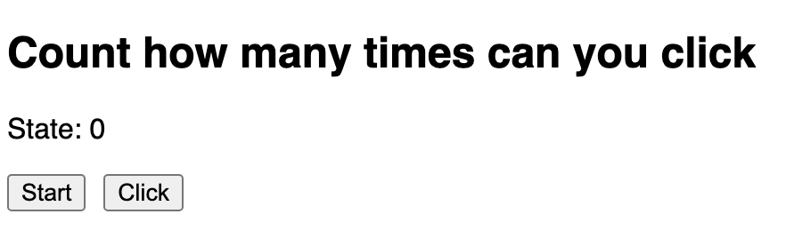
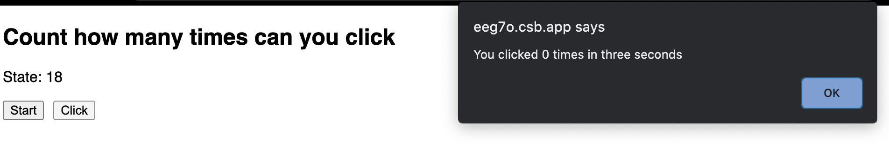
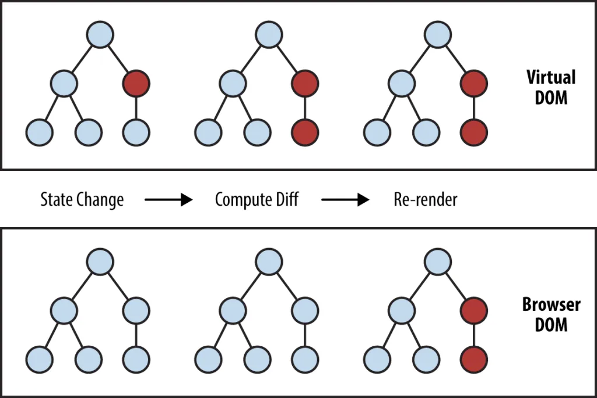
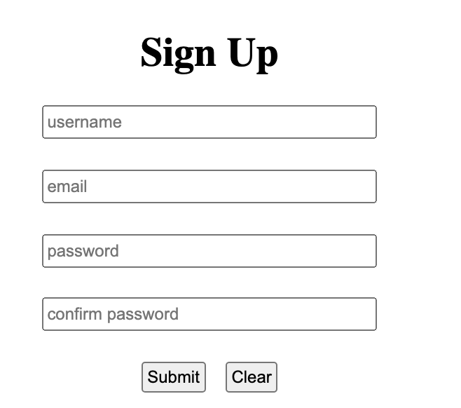
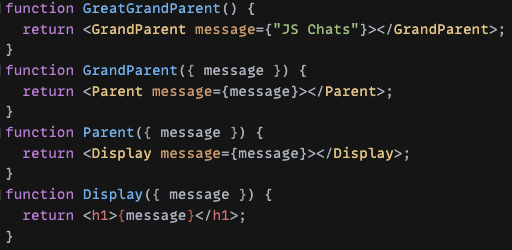
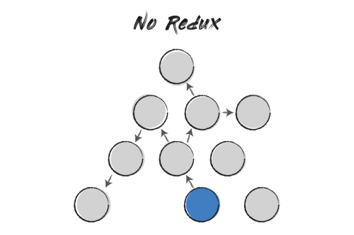
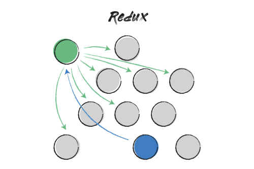

# Advanced React Hooks

## JavaScript Chats Hack Session 6, Spring 2021

### May 18, 2021

#### By Tristan Que

> This blog post is written by one of JS Chat's participant Tristan Que. You can find Tristan on...
>
> - LinkedIn: https://www.linkedin.com/in/tristanque2000/
> - GitHub: https://github.com/Tristan816la

**Table of Contents**

- [About the author](#about-the-author)
- [useRef](#useref)
- [Custom React Hooks](#custom-react-hooks)
- [useReducer](#usereducer)
- [useContext](#usecontext)

## About the author

Hi! My name is Tristan! I'm a second-year CS major at UCLA, and I'll be interning at Yahoo! this upcoming summer.

When I started to learn about React functional components, I was really confused about how each hook is used. I felt that I knew how each hook works by reading the documentation, but I was pretty lost on how and why they are useful. Like everyone, I started off by only using `useState` and `useEffect`, and was always confused by `useEffect`.

However, when I had more and more experience with React, I found out I need to use different hooks for different purposes. At that time, I started to summarize how each hook could be used and gradually realized how powerful hooks actually are. It takes me multiple projects to fully understand how each hook is used, but they could actually be boiled down to a few use cases with a few examples. I hope when I was learning hook, React documentation could list these use cases.

So, I decided to give a summary on a few interesting hooks. Each hook is introduced by a problem that cannot be easily solved using basic hooks, and details for the hooks follow the problems. I hope you find them helpful, and enjoy studying!

## useRef

### Stale Closure

Consider the following example where we try to build a counter to count how many times the user clicks on the "click" button after the start, and print the results through `alert`:

```jsx
export default function () {
	const [count, setCount] = useState(0);

	const handleStart = () => {
		setTimeout(() => {
			alert(`You clicked ${count} times in three seconds`);
			setCount(0);
		}, 3000);
	};

	return (
		<div>
			<p>State: {count}</p>
			<div className='btns'>
				<button onClick={handleStart}>Start</button>
				<button onClick={() => setCount(count + 1)}>Click</button>
			</div>
		</div>
	);
}
```



Before we delve into the demo, consider the following questions:

- Is this counter going to work as expected?
- How would the value "State: 0" change each time the user clicks on the click button?
- What are you expected to see three seconds after you clicked on start?

> CodeSandbox demo: [Count Many Times](https://codesandbox.io/s/count-many-times-eeg7o)

<details>
<summary>
Solution
</summary>

This counter cannot work as expected. After trying the demo, you can see the count in "State: {count}" is incremented by one each time the user clicks on the "click" button but the alert message is showing 0 after three seconds. Why would this happen?

This is due to the fact that each render in React has its own states, props, event handlers, ... and everything. At the time you click on the start button, setTimeOut() puts the callback function together with count = 0 onto the web API, then after three seconds, a message associated with count = 0 is printed.

Notice even though "state:0" is incremented normally, it doesn't conflict with the fact each render has its own state. In fact, every time we click the "click" button, the state has changed, which triggers re-rendering.



</details>

Unfortunately, our first attempt to build a counter failed. If we want to register a timer and count how many times the user clicks on the "click" button, we would like to know the immediate value before the alert. However, as we discussed above, each render has its own "everything", there seems to be no way for us to register a handler in one render and use the state from another render.

However, there is a way to bypass the constraint of the React functional components — `useRef`.

Bonus: From JavaScript's functions' perspectives, this problem is also known as the "stale closure". Here is an example you can try out to learn more about it!

[JavaScript Tutor - Visualize JavaScript code execution to learn JavaScript online](https://tinyurl.com/staleclosure)

### useRef

From React documentation, [https://reactjs.org/docs/hooks-reference.html#useref](https://reactjs.org/docs/hooks-reference.html#useref)

```js
const refContainer = useRef(initialValue);
```

`useRef()` returns a mutable ref object whose `.current` property is initialized to the its argument (`initialValue`).

The returned object will persist for the full lifetime of the component.

In other word, when we create a ref object, it looks like this:

```jsx
{
	current: initialValue;
}
```

But what's more interesting is the second property: the ref object will persist for the full lifetime of the component. In other words, `useRef` will give you the same ref object on every render. Let's go back to our previous example, except this time we add `useRef`:

```jsx
export default function () {
	const [count, setCount] = useState(0);
	const latestCount = useRef(count);

	const handleStart = () => {
		setTimeout(() => {
			alert(`You clicked ${latestCount.current} times in three seconds`);
			setCount(0);
			latestCount.current = 0;
		}, 3000);
	};

	return (
		<div>
			<p>State: {count}</p>
			<div className='btns'>
				<button onClick={handleStart}>Start</button>
				<button
					onClick={() => {
						setCount(count + 1);
						latestCount.current++;
					}}
				>
					Click
				</button>
			</div>
		</div>
	);
}
```

> CodeSandbox demo:
> [count many times (ref)](https://codesandbox.io/s/count-many-times-ref-tetxy?file=/src/Counter.js)

In this example, when the async function is defined inside `setTimeout`, it saves a reference to the variable it uses, i.e. `latestCount.current` is set to `count`. When we click on the click button, the `current` attribute in `latestCount` is updated. Since this `latestCount` is the same ref object on every render, when the async callback is called, it returns the value in the only `latestCount`. That's why you could see a value equal to the number of times you clicked after the start.

However, in addition to dealing with the weird features of React lifecycles, there is a more common usage of `useRef` — create a reference to the node in the DOM.

### Virtual DOM

Before delving into the common usage of `useRef()`, let's meet our old friend DOM and a new friend virtual DOM.

The DOM stands for "Document Object Model", which is the data representation of the objects that comprise the structure and content of a document on the web. It is represented as a tree structure. Because of that, the changes and updates to the DOM node are really fast. However, after changes, it needs to re-render the UI, which might trigger changes to the parent of nodes, children of nodes, or even the entire document tree, which is really slow. In order to counter this performance loss, React uses a virtual representation of the DOM, i.e. the virtual DOM with optimization techniques to boost rendering speed.



React adds the steps to check for state updates and compute differences

Virtual DOM enables the declarative API of React. You tell React what state you want the UI to be in, and it makes sure the DOM matches that state. This abstracts out the attribute manipulation, event handling, and manual DOM updating that you would otherwise have to use to build your app. Also, for better performance, Virtual DOM does a process called [reconciliation](https://reactjs.org/docs/reconciliation.html), which include processes like "diffing" (only updating objects that are different by comparing previous virtual DOM tree) and "batch updating".

However, this abstraction of the DOM sometimes causes trouble when we truly want to access the DOM directly in React. This is where `useRef` comes into play. (P.S. `useRef` is not the only way to create ref in functional components, but it is the most common way). By creating a ref using `useRef` and pass the ref object to the DOM node, React will set its `.current` property to the node whenever that node changes.

Let's demonstrate this by an example.

> CodeSandbox demo:
> [DOM ref](https://codesandbox.io/s/gracious-glade-9c1s2?file=/src/App.js)

```jsx
export default function App() {
	const [open, setOpen] = useState(false);
	const dropDownRef = useRef();
	useEffect(() => {
		const clickOut = e => {
			if (
				open &&
				dropDownRef.current &&
				!dropDownRef.current.contains(e.target)
			)
				setOpen(false);
		};
		document.addEventListener('click', clickOut);
		return () => {
			document.removeEventListener('click', clickOut);
		};
	}, [open]);

	console.log(dropDownRef.current);

	return (
		<div open={open}>
			<button onClick={() => setOpen(!open)}>{open ? 'close' : 'open'}</button>
			<ul style={open ? dropdownStyle : { display: 'none' }} ref={dropDownRef}>
				<li>1</li>
				<li>2</li>
				<li>3</li>
			</ul>
		</div>
	);
}
```

In this example, we notice that our `dropDownRef` starts with a value `undefined` when the component is not rendered. However, after clicking on the open button, the node is changed and `ref.current` is set to `<li style="background: lightblue; width: 100px;">…</li>` . When we close the dropdown by clicking out the dropdown or click on the close button, the current attribute is set to `<li style="display: none;">…</li>` .

## Custom React Hooks

In the previous example, notice that we registered a `useEffect` that helped us detect whether we clicked out of the dropdown and closed the dropdown correspondingly. This logic might be useful across different React components. Is there a way to replicate this logic and use it multiple times?

In fact, in React, you can create your own hooks. Let's take a look!

In useClickOutState.js:

```jsx
import { useState, useEffect, useRef } from 'react';

const useClickOutState = () => {
	const [open, setOpen] = useState(false);
	const ref = useRef();
	useEffect(() => {
		const clickOut = e => {
			if (open && ref.current && !ref.current.contains(e.target))
				setOpen(false);
		};
		document.addEventListener('click', clickOut);
		return () => {
			document.removeEventListener('click', clickOut);
		};
	}, [open]);
	return [open, setOpen, ref];
};
```

In App.js:

```jsx
export default function App() {
	const [open, setOpen, dropDownRef] = useClickOutState();
	return (
		<div open={open}>
			<button onClick={() => setOpen(!open)}>{open ? 'close' : 'open'}</button>
			<ul style={open ? dropdownStyle : { display: 'none' }} ref={dropDownRef}>
				<li>1</li>
				<li>2</li>
				<li>3</li>
			</ul>
		</div>
	);
}
```

In the above example, we create a custom hook called `useClickOutState` that wraps our "click out" logic above into a component. It is a function returning a state, a setState handler, and a ref object we can use to specify which component we want to use to detect "click out". Then in our App.js, we can simply initialize the hook and use them. Hooray!

> CodeSandbox demo: [useClickoutState](https://codesandbox.io/s/useclickoutstate-se527)

In fact, there is nothing special when you want to create your own hook. However, there are a few benefits when creating hooks with `use` signature at start:

1. ESLint will help check with the rules of hooks
2. Reuse stateful logic like our example
3. There are open-source communities that create hooks for you, or you can create hooks for them (check out [awesome-react-hooks](https://github.com/glauberfc/awesome-react-hooks))
4. Weird Flex but OK

## useReducer

By using custom hooks, we can interact with React states in really creative ways. However, when we talk about states in functional components, `useState` is not the only way that you can interact with states.

### New Problem - Sign-Up Form

Suppose we're building a sign-up form on the client side. For this form, we require the user to enter the user name, password (& confirm password), and email. The user could submit the form or clear the form. You might be familiar with how to implement a form using `useState`, so you came up with the following implementation (We ignored the confirm password check on the client side):



```jsx
const [username, setUsername] = useState('');
const [email, setEmail] = useState('');
const [password, setPassword] = useState('');
const [confirmPassword, setconfirmPassword] = useState('');

const handleUserNameChange = e => {
	setUsername(e.target.value);
};

const handleEmailChange = e => {
	setEmail(e.target.value);
};

const handlePasswordChange = e => {
	setPassword(e.target.value);
};

const handleConfirmPasswordChange = e => {
	setconfirmPassword(e.target.value);
};

const handleSubmit = e => {
	e.preventDefault();
	const body = {
		username,
		email,
		password,
		confirmPassword,
	};
	alert(JSON.stringify(body, null, 2)); // send to backend
};

const handleClear = () => {
	setUsername('');
	setEmail('');
	setPassword('');
	setconfirmPassword('');
};
```

This looks fine. We created a state for each of the field. Then, we create handlers for changing each field, and two helper methods -- `handleSubmit` to construct an object to submit and `handleClear` to set all the fields back to empty strings.

However, what if I told you there is a built-in hook `useReducer` in React that could greatly simplify this process?

Specifically,

```jsx
const initialState = {
  username: "",
  email: "",
  password: "",
  confirmPassword: ""
};

function reducer(state, action) {
  switch (action.type) {
    case "UPDATE":
      return { ...state, [action.field]: action.value };
    case "CLEAR":
      return initialState;
    default:
      throw new Error();
  }
}

export default function SignUp() {
  const [state, dispatch] = useReducer(reducer, initialState);
  const { username, password, email, confirmPassword } = state;

  const updateChange = (field, value) => {
    dispatch({ type: "UPDATE", field, value });
  };

  const handleSubmit = (e) => {
    e.preventDefault();
    alert(JSON.stringify(state, null, 2)); // send to backend
  };

	const handleClear = () => dispatch({ type: "CLEAR" });
... // For html
```

But before we look into how `useReducer` works, why don't we figure out how it works by ourselves and implement our own version of `useReducer`? We've implemented a custom hook and we know that custom hooks could give us unlimited flexibility. Can we implement our `useMyReducer` that works the same as the built-in `useReducer` in the example above?

Yes, we can.

### Implement useMyReducer - Part 1, State

We'll implement our own hook by inspecting the patterns `useReducer` has.

First, look at how the state is managed when using `useReducer`. Instead of creating a new state for each of the field, `useReducer` creates a central state object that organizes every field and passes the central object to the reducer. We can easily simulate this behavior using `useState`:

```jsx
const [state, setState] = useState(initialState);
```

### Implement useMyReducer - Part 2, dispatch

We're halfway there! In order to update the states, we can take a look at `handleClear` and `updateChange` are implemented. In both functions, they use a special method called `dispatch` , what the `dispatch` does is it'll take in a parameter with the form `{type: "XXX", ... (optional attributes)}` , and update the state to a new state accordingly by a switch on `action.type` . So, if we want to implement a `dispatch` function, we can do the following:

```jsx
function dispatch(action) {
	const newState = reducer(state, action);
	setState(newState);
}
```

### Implement useMyReducer - Part 3, finish up

Since we want all above to be in our own hook, we can wrap everything into one hook function. Look at the declaration of `useReducer()`, we can confirm the return values to be the state, and the `dispatch()` function

```jsx
function useMyReducer() {
	const [state, setState] = useState(initialState);

	function dispatch(action) {
		const newState = reducer(state, action);
		setState(newState);
	}

	return [state, dispatch];
}
```

We can try out our `useMyReducer`, click on the following demo to see the result:

> CodeSandbox demo:
> [useMyReducer](https://codesandbox.io/s/usemyreducer-7ipi4)

Yay! It works!

### When do you want to use `useReducer`?

Generally, the usage for `useReducer` could be summarized to the following three situations:

- You want to use `useReducer` when there is complex state logic.
- You want to use `useReducer` for state management.
- You want to use `useReducer` when you want to think of the actions in an atomic way.

## useContext

### Problem w/o state management: Props Drilling



Look at the screenshot above, when the concept of state management hasn't been introduced, if you want to pass a prop message from the `GreatGrandParent` to the deep child `Display` component for showing the message, you need to pass this prop through all the ancestors of `Display`. This is the problem called "props drilling", where you have to pass a prop through several components in order to use that prop. Even though this still looks fine, it'll become more complicated when many components require props from `GreatGrandParent` and it could quickly become a mess.

The problem without an ultimate state manager can be illustrated by the following graph. In order to let child components use the states from the root component (assume the blue circle is the root component), we need to perform a DFS-like graph traversal. This is inefficient in itself, but what makes matters worse is that if you store every global state in the root component and one state has changed, every component in the component tree needs to be re-rendered, since every node is essentially a child of the root component. This is very inefficient.



However, with the introduction of the state management tool such as Redux, all the components' states can be centralized to a structure called "store". It helps you manage the so-called "global state", and every time the global state gets updated, only the components that subscribe to the global state will be updated. This saves a lot of unnecessary overhead and development time.



The Green Circle is the store, and the blue circle is the root component.


React Redux still remains the best tool for implementing the "global state management" (or a more accurate term, "flux architecture") for now. However, React has its own nice API for handling the global state management - [Context API](https://reactjs.org/docs/context.html). With the introduction of `useContext`, this API becomes pretty easy to use in React functional components.

### A Glimpse of useContext

```jsx
const messageContext = React.createContext();

function reducer(state, action) {
	switch (action.type) {
		case 'UPDATE':
			return { message: action.payload };
		default:
			throw new Error();
	}
}

function GreatGrandParent() {
	const [state, dispatch] = useReducer(reducer, { message: 'JS Chats' });
	const value = { state, dispatch };
	return (
		<messageContext.Provider value={value}>
			<GrandParent />
			<Parent />
			<Display />
		</messageContext.Provider>
	);
}

function GrandParent() {
	const { state, dispatch } = useContext(messageContext);
	console.log('GrandParent: ', state, dispatch);
	return <></>;
}
function Parent() {
	const { state, dispatch } = useContext(messageContext);
	console.log('Parent: ', state, dispatch);
	return <></>;
}

function Display() {
	const { state, dispatch } = useContext(messageContext);
	return (
		<>
			<h1>{state.message}</h1>
			<button
				onClick={() => dispatch({ type: 'UPDATE', payload: 'JS Chats!' })}
			>
				!
			</button>
		</>
	);
}
```

> CodeSandbox demo:
> [context](https://codesandbox.io/s/props-drilling-chhhv?file=/src/App.js)

In this example, "GreatGrandParent" is our top-level component. We create a state and `dispatch` method method using `useReducer` and pass the state and dispatch to `messageContext.Provider`. In Context API, the components that are wrapped between context providers can use the global context (they're also known as consumers). When the global context changed, the corresponding component that subscribes to the global context will also get re-rendered.

In our `Display` component, we extract from the context the `state` and the `dispatch` method, then pass the button an `onClick` function to update the message with `dispatch`.

However, this program has a potential flaw and may cause inefficiency. Could you tell what that is? (Hint: think of the condition when components get updated when using context)

<details>

<summary>Solution</summary>

The reason why this program is flawed is because of `value`. Specifically, in the `GreatGrandParent` component, if the state of the `GreatGrandParent` has changed, the entire component will be re-rendered and a new instance of value will be created, which will trigger the re-rendering of all consumers of this context. We don't want the change of `value` to cause re-rendering of consumers, so we can do the following:

```js
const value = useMemo(() => {
	state, dispatch;
}, []);
```

However, this approach is still not the best. Suppose in your component-tree there are some components which only update the global state but don't subscribe to the global state, you don't want these components to be re-rendered when the global state has been updated. So, what React documentation suggests, is to separate `state` and `dispatch` into two contexts.

Specifically,

```jsx
const MessageContext = React.createContext()
const MessageDispatchContext = React.createContext()
// reducer, initial value,...

return (
  <MessageDispatchContext.Provider value={dispatch}>
    <MessageContext.Provider value={state}>
    {* consumers *}
    </MessageContext.Provider>
  </MessageDispatchContext.Provider>
)
```

</details>

### When to use useContext

Compare to Redux and other state management tools, useContext has several advantages:

1. It's built-in in React
2. Learning curve for context API is a little more gentle than Redux
3. Bundle sizes are small

However, the performance of the Context API is worse than Redux, and Redux has different middleware that supports many functionalities that the context API cannot do (e.g. redux thunk for async action creators).

As a result, the Context API is recommended to be used in the small or medium sized application, whereas Redux is still the most common tool for large-scale applications that require high-frequency state updates.

## Reference

1. Hooks API Reference

[https://reactjs.org/docs/hooks-reference.html](https://reactjs.org/docs/hooks-reference.html)

2. Introduction to the DOM

[https://developer.mozilla.org/en-US/docs/Web/API/Document_Object_Model/Introduction](https://developer.mozilla.org/en-US/docs/Web/API/Document_Object_Model/Introduction)

3. What is the Virtual DOM?

[https://reactjs.org/docs/faq-internals.html](https://reactjs.org/docs/faq-internals.html)

4. Building Your Own Hooks

[https://reactjs.org/docs/hooks-custom.html](https://reactjs.org/docs/hooks-custom.html)

5. In-depth Overview of Flux-architecture

[https://facebook.github.io/flux/docs/in-depth-overview/#:~:text=Flux is the application architecture,a lot of new code](https://facebook.github.io/flux/docs/in-depth-overview/#:~:text=Flux%20is%20the%20application%20architecture,a%20lot%20of%20new%20code).

6. A beginner guide's to redux

[https://medium.com/@bretcameron/a-beginners-guide-to-redux-with-react-50309ae09a14](https://medium.com/@bretcameron/a-beginners-guide-to-redux-with-react-50309ae09a14)

7. Using Redux and Context API

[https://www.codehousegroup.com/insight-and-inspiration/tech-stream/using-redux-and-context-api#:~:text=Context API is easy to,creating unnecessary work and complexity](https://www.codehousegroup.com/insight-and-inspiration/tech-stream/using-redux-and-context-api#:~:text=Context%20API%20is%20easy%20to,creating%20unnecessary%20work%20and%20complexity).

8. A Complete Guide to useEffect

[https://overreacted.io/a-complete-guide-to-useeffect/](https://overreacted.io/a-complete-guide-to-useeffect/)
