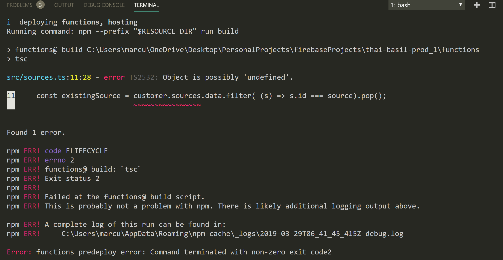
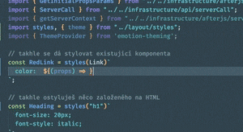
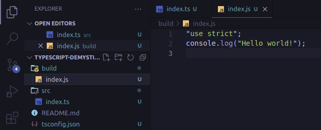

# TypeScript - What is it and why should I care?

## JavaScript Chats Hack Session 7, Spring 2021

### May 25, 2021

#### By Omer Demirkan

> This blog post is written by one of JS Chat's participant Omer Demirkan. You can find Omer on...
> - Website: https://omerdemirkan.com
> - LinkedIn: https://www.linkedin.com/in/omer-demirkan/
> - GitHub: https://github.com/omerdemirkan

**Table of Contents**

  + [Motivations](#motivations)
  + [Getting Started](#getting-started)
  + [TypeScript Language Features](#typescript-language-features)
  + [Library Support](#library-support)
  + [Wrapping it all up](#wrapping-it-all-up)

## Motivations

Imagine this utility function that takes in a name and returns a greeting string.

```jsx
const getUserGreeting = firstName =>  `Hi there, ${firstName}!`
```

Say we want to refactor this to accept a user object in order to extend some functionality.

```jsx
const getUserGreeting = user =>  {
	if (isNear(user.currentLocation, user.homeLocation))
		return `Hi there, ${user.firstName}, welcome home!`
	else
		return `Hi there, ${user.firstName}!`
}
```

Now, take a look at this Javascript snippet consuming this utility function in the global execution context.

```jsx
const greeting = getUserGreeting("Omer")
console.log(greeting) // Hi there, undefined!
```

With this refactor, we have introduced a **bug** 🐛 (his name is Alfred, please say hi to Alfred).

This is known as a type-safety error and is the result of two core features of JavaScript as a language: dynamic typing and interpretation. In JavaScript, we can reference variables that don't exist, call functions without passing arguments, or work with objects of an unknown shape, and any resulting errors are thrown in run-time as there is no compile step (slightly oversimplified).

In this scenario, finding Alfred is trivially simple; although it doesn't throw an error, since Alfred sits in the global execution context, it's immediately invoked and the result is printed out to our console. Finding type-safety bugs in JavaScript is easy, right?

Now, take a look at these snippets consuming the same hypothetical utility function, firstly in the context of a browser, and then in the context of an express endpoint.

```jsx
const button = document.querySeletor("#btn")
const header = document.querySelector("#header")
button.addEventListener("click", function() {
  header.innerText = getUserGreeting(currentUser.firstName)
		 + "\nWe've been trying to reach you about your vehicle's extended warranty"
})
```

```jsx
const router = new express.Router()
router.get("/user-greeting", async function(req, res) {
	const user = await userService.findUserById(req.query.user_id)
	const greeting = getUserGreeting(user.firstName)
  res.send(greeting)
})
module.exports = router
```

Unlike the example prior, the use of this utility function is event-driven. Why is this important? Because there aren't any immediate red flags that we've introduced a bug; finding this error now involves clicking a specific button, or testing a specific endpoint. Without integration tests for these click listeners and express endpoints, this bug suddenly isn't as noticeable as it used to be, and can very easily slip into production, hindering both user experience as well as developer productivity.

Now, imagine this in the context of a large-scale project with hundreds of event listeners and with dozens of other branches consuming the same utility functions, services, middlewares etc.

Suddenly, finding simple type-safety errors in development becomes non-trivial. In fact, without established integration testing, the flexibility that dynamic typing in JavaScript provides is often the culprit of why this class of bugs is so often pushed into production in large-scale JavaScript projects, with [up to 20%](https://earlbarr.com/publications/typestudy.pdf) of bugs being attributable to type safety alone.

### TypeScript to the rescue?

One tool that attempts to address these inherent type-safety issues is TypeScript, a language that both syntactically extends JavaScript and compiles to JavaScript.

### What TypeScript is

TypeScript is a static type-checker that analyzes your source code to catch silly type-safety errors in development before they become infuriating, costly runtime errors in production or during CI/CD tests.



TypeScript is fundamentally a compiler. By adding the step of compiling to JavaScript, we have the added benefit of specifying the exact compilation target. For instance, I may choose to compile to ES5 to support legacy browsers while using all the latest features of JavaScript.

TypeScript is syntactically a strict superset of JavaScript, meaning **all valid JavaScript is valid TypeScript**, with all type definitions being optional**.** This means its learning curve is as steep or as flat as you want it to be, as it fully supports incremental adoption.

TypeScript is loved by developers. Not only do you get type-checking in the terminal in build-time, but in an IDE with TypeScript support, you can get a whole host of quality-of-life features. 




A recent [StackOverflow survey](https://insights.stackoverflow.com/survey/2020#technology-most-loved-dreaded-and-wanted-languages-loved) found that it's the 2nd most loved language after Rust (curse you Rust!)

### What TypeScript is not

TypeScript is not an independent alternative to JavaScript. You can't run TypeScript; it must first be compiled to JavaScript, whether it's manual or [automatic](https://www.freecodecamp.org/news/the-deno-handbook/#first-class-typescript-support).

TypeScript is not a tool for type-checking in run-time. Type-checking only occurs in build-time / compile-time. This means that runtime validation, such as validating an HTTP request body is still necessary.

TypeScript is not a magic bullet to avoid bugs or an alternative to writing tests. While it helps in catching type-safety errors in development, you are still free to introduce logical bugs into a TypeScript project to your heart's content.

Finally, TypeScript is not a one-size-fits-all solution. Much like anything, you should first consider the costs and benefits of the language as it relates to your project.

With expectations set, lets jump in!

## Getting started

Firstly, with nodejs and npm installed, lets install the typescript as a global dependency.

```bash
npm install --global typescript
```

Note that linux/mac users may need superuser privileges. For this, prepend **sudo** to this command.

This will give us direct access to the TypeScript compiler through the **tsc** command.

To get started, let's make our obligatory TypeScript hello world program! Open a new directory and create an **src** directory and an *index.ts* file in the root of this new directory with the following code:

```jsx
console.log("Hello World")
```

Now, lets compile this TypeScript into JavaScript with our tsc command.

```bash
tsc index.ts
```

This will build an index.js file in the root of your project that you can now run.

```bash
node index.js
> Hello world
```

Now that our we've been indoctrinated to TypeScript through the Hello World ritual, let's do some configurations that will make our lives easier as we explore TypeScript's language features.

Let's create a TypeScript config file. Although you can pass arguments to the typescript compiler in the command line, it's often much more convenient to define a tsconfig.json file at the root of your project. Let's create a default config file with this command

```bash
npx tsc --init
```

With boilerplate out of the way, open tsconfig.json and add the following compiler options:

```json
"outDir": "./build" /* Redirect output structure to the directory. */,
"rootDir": "./src" /* Specify the root directory of input files. Use to control the output directory structure with --outDir. */,
```

Next, create an **src** directory in the root of your project, move our *index.ts* file within it, then run:

```bash
tsc
```

This will create a build directory in the root of your project that mirrors your TypeScript source in JavaScript. 



## TypeScript Language Features

### Variables and Primitives

---

To give a type to a variable we use this syntax:

```tsx
// Type annotation when not initialized on declaration
let age: number;
age = 24

// Explicit type annotation when initialized on declaration
let name: string = "Omer";

// Implicit type annotation when initialized on declaration
let isTeenager = age <= 19 && age >= 13;
// TypeScript will treat this variable as a boolean,
// even though we haven't explicitly told it to.
```

This will ensure that these variables only contain the type they were assigned to.

```tsx
age = "Not a number" // This will cause a TypeScript error
```

However, this may be constricting for us; our freedoms with dynamic typing seem to have disappeared. To allow a variable to hold more than one type, we can use the TypeScript union operator.

```tsx
let stringOrNum: string | number = 5;
stringOrNum = "Yaay, some added flexibility!";
```

Further, we can use the union operator to conjoin literal values as types

```tsx
let myMood: "happy" | "sad" | "excited" | "anxious" | null = "happy";
myMood = "anxious"
myMood = "1l2u3h4l1ij25h4kh1l243jk5h" // TypeScript error
```

In turn, TypeScript will notify you if there is a possibility of a type error if the type of a variable isn't determined at a certain point in a program:

```tsx
myMood.indexOf(" ") // TypeScript error may occur since myMood may be null
```

However, this seems to already bloat what is meant to be a simple variable. If we want to reuse types to enforce uniformity, reduce repetition, and separate concerns, we can create our own custom types with this syntax:

```tsx
type Mood = "happy" | "sad" | "excited" | "anxious" | null;

let myMood: Mood = "anxious"
let yourMood: Mood = "happy"
```

If we choose to refactor our types, TypeScript will notify us of any potential issues we introduce.

### Functions

Let's create a function *repeatString* that takes a string *str* along with a number *n* representing how many repetitions we want, and returns the string *str* repeated *n* times. To annotate this, we can use this syntax:

```tsx
function repeatString(str: string, n: number): string {
	return new Array(n).map(() => str).join("");
}
```

And if you prefer arrow functions or the *this* keyword forced your hand:

```tsx
const repeatString = (str: string, n: number): string => {
	return new Array(n).map(() => str).join("");
}
```

A function without the return keyword, by default, has a return type of *void*. However, this can be explicitly annotated as such:

```tsx
function logTime(): void {
	console.log(`The current date is ${new Date().toString()}`)
}
```

While unions provide some flexibility for our functions, sometimes this won't have the behavior we want. Take a look at this example:

```tsx
function add(a: number | string, b: number | string): number | string {
	return a + b;
}
```

Although we want this function to be able to both add numerically as well as concatenate strings, the compiler isn't happy with the possibility of adding a string to a number. Further, the return type for those consuming the function is ambiguous. To work around this, we can overload this function as such:

```tsx
// Numeric addition type declaration
function add(a: number, b: number): number;
// Concatenation type declaration
function add(a: string, b: string): string;

// Implementation
function add(a: any, b: any) {
	return a + b;
}
```

In this manner, passing parameters of differing types into our add function is prohibited, and those consuming the function will receive a value of a definite type.

```tsx
const inferredString = add("Hello ", "there");
const inferredNum = add(1, 2);
const prohibited = add(1, "2"); // TypeScript error
```

### Objects

Similar to variables, we can explicitly type our objects. Creating an object with string attributes firstName and lastName looks like so:

```tsx
let me: { firstName: string; lastName: string };
let johnWick: { firstName: string; lastName: string };

me = { firstName: "Omer", lastName: "Demirkan" };
johnWick = { firstName: "John", lastName: "Wick" };
```

However, it seems as though, once again, we have duplication; writing out this type definition for each user variable we create is counterproductive. Let's once again create a reusable type!

There are two ways to create types for objects. One way is with the *type* keyword

```tsx
type Person = { 
	firstName: string; 
	lastName: string 
};
```

and the other is using the *interface* keyword.

```tsx
interface Person { 
	firstName: string; 
	lastName: string 
};
```

Either way, we can use them as such:

```tsx
const me: Person = { firstName: "Omer", lastName: "Demirkan" };
```

Once again, if we choose to refactor our types, TypeScript will notify us of discrepencies.

To add an optional *middleName* property, we can use this syntax:

```tsx
interface Person { 
	firstName: string; 
	middleName?: string;
	lastName: string 
};
```

TypeScript will now allow a property *middleName* of type *string* on any person object, but will not enforce its existence. Further, if any piece of our code de-facto assumes the existence of a *middleName* property on a person object, TypeScript will notify us to address the condition where it doesn't exist on the object at runtime.

### Generics

In TypeScript, generics are most commonly used in interfaces and in functions to better declare types dynamically, be that to type an object or to have TypeScript infer a return type of a specific function call.

Lets say we are interacting with a web API that returns responses of this shape:

```tsx
interface ApiResponse {
	status: boolean;
	message: string;
	data: any;
}
```

Although giving the response data a type of *any* saves us from typing every API endpoint, this opens our application up to type-safety errors, as TypeScript will not type-check the data property.

To work around this, we can use generics! We can specify a template *T* scoped to our interface and pass it to our dynamic property *data*.

```tsx
interface ApiResponse<T> {
	status: boolean;
	message: string;
	data: T;
}
type PersonApiResponse = ApiResponse<Person>;
```

Let's explore another use case of generics is in the context of functions.

In Python, getting the last element of a list is as simple as getting the element at index -1, however, the same functionality in JavaScript involves retrieving the array's length at runtime and normalizing it to be zero-indexed.

```tsx
const lastElement = elements[elements.length - 1]
```

Let's create a helper function *lastOf* that does this and returns a value of a type based on the input array. We can do this by creating a template T scoped to our *lastOf* function that is then used to describe the shape of the input and output types.

```tsx
function lastOf<T>(elements: T[]): T {
	return elements[elements.length - 1];
}

// Explicitly passing generics
let num = lastOf<number>([1, 6, 3, 5]);

// TypeScript infers that this variable is a string.
let str = lastOf(["an", "array", "of", "strings"]);

str = 2 // TypeScript error, str is a string
num = "Not a number" // TypeScript error, num is a number
```

## Library Support

npm libraries largely fall under three categories:

1. Packages with types defined internally
2. Popular packages without defined types, but with community supplied types
3. Not-so-popular packages without defined types or community supplied types

With the first class of npm packages, no changes need to be made. However, for the second class of packages, there is a [community-supported monorepo](https://github.com/DefinitelyTyped/DefinitelyTyped) from which types can be seamlessly added. For instance, to install the types for *lodash* (a package that doesn't provide types) as a development dependency, we can run the following command:

```tsx
npm install --save-dev @types/lodash
```

All types and TypeScript related packages should be installed as development dependencies, as they only used in development and not in production builds.

For the third class of packages, we can define types based on the package's documentation. [Here](https://www.credera.com/insights/typescript-adding-custom-type-definitions-for-existing-libraries)'s a useful resource for those looking to write custom types for a package.

## Wrapping it all up

We've gone through the motivations behind type safety, the fundamentals of what TypeScript is and what it isn't, a handful of features that TypeScript has to offer, and its interaction with external packages.

Whether you find the features provided by TypeScript compelling or not, it's a tool that has won the hearts of JavaScript developers that have tried it, and is slowly winning over industry. At the very least, TypeScript stands as a technology to watch in the coming years.

If you're looking for detailed explanations of TypeScript's feature set, or you're a nerd, feel free to look into the [TypeScript documentation](https://www.typescriptlang.org/) for other features such as namespaces, interface inheritance and composition, tuples, OOP support, decorators, enumerations, and much more.
